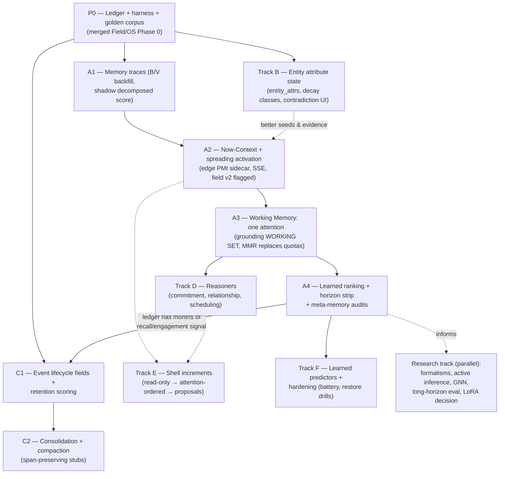

# Cognitive OS v2 — Merged Roadmap

**One sequence reconciling three inputs:** the shipped v1 substrate (`nexus_v1` as of July 20, 2026), the Attention Field design (`memory_field_cognitive_architecture.md`), and the Cognitive OS v2 implementation plan (the ten governing decisions).

*Roadmap document · July 20, 2026 · supersedes the OS plan's §3 phasing; adopts its decisions as dispositioned below.*

The reconciling insight: **the Attention Field design is Layers 4–5 of the OS plan** (context assembly, activation, working memory, the impressions ledger, learned ranking) **already specified at implementation depth, with dependencies that exist in shipped code today.** The OS plan's Phase 1, by contrast, re-specifies work that is largely shipped. So the merged sequence pulls attention forward, shrinks the world-model phase to its genuine delta, and pushes the memory economy to where its input signal actually exists.

---

## 1. Decision register

Final disposition of the OS plan's ten governing decisions. "Adopt" means as written; "amend" means adopted with a binding change; one decision is explicitly left open.

| # | Decision | Disposition |
|---|---|---|
| D1 | Events demoted, not deleted; world model is the read layer | **Adopt — mostly already true.** Nothing above the substrate reads raw events except the semantic fallback and evidence hydration. New work is only absorption/compaction, and it is bound by the span-preservation invariant (I-1, §5). |
| D2 | Hybrid symbolic/latent entity store | **Adopt — ~70% shipped** (typed entities + embedding BLOBs + typed weighted edges with confidence/origin + Lance). The delta is per-attribute entity state with decay (Track B). |
| D3 | Explicit rule-based belief updating | **Adopt — mostly shipped** in `fact_gate.py` (corroborate→touch/max-confidence, contradict→adjudicate→supersede). Delta: per-attribute-type decay + contradiction *surfacing* UI (today `update` verdicts resolve silently). |
| D4 | Prediction heuristic-first, learned later | **Adopt.** Identical to Attention Field §13.1. Heuristics = calendar horizon + hazards + rhythm; learned predictors are a Month 9+ concern. |
| D5 | Context assembly replaces retrieval; search demoted to fallback | **Adopt.** This *is* the Field's Working Memory layer (§11). One attention state, two consumers; semantic fallback retained inside `grounding.compose`. |
| D6 | LoRA retired from the personalization critical path | **OPEN — this is a pivot, not a confirmation.** The standing roadmap keeps the Phase-3 idle LoRA trainer (`phase3_lora_architecture.md`, `distill_curate.py` → `train_lora.py`). Recommendation and decision date in §6. Nothing in Months 1–6 depends on the outcome either way — the distill trail keeps paying for few-shot, bench, and ranking regardless. |
| D7 | Blackboard multi-agent cognition | **Amend: reasoners first, blackboard only when earned.** The arbiter's core already exists (`readiness.decide()` risk bands + two-signal offer gate + offer TTL/cooldown). New reasoners start as siblings of the existing `IntentCompiler`s reading the shared WM. A generic blackboard is built only when ≥3 reasoners demonstrably contend for the same surfacing budget. |
| D8 | Reflection emits typed, machine-actionable outputs | **Amend: two output classes.** *Attention-only* outputs (urgency escalation, bounded decay/weight tuning) may auto-apply — capped, logged, reversible. *Truth* outputs (anything mutating user-visible facts/entities) stay review-first through the existing reflections UI. Reflection never touches approval gating, risk classification, or the trust gate. `reflection_items` are already typed/grounded/reviewable; the new part is the auto-apply class and its caps. |
| D9 | Evaluation harness ships first | **Adopt — merged with the Field's Phase 0.** The impressions ledger, `cog_telemetry`, the golden behavioral contracts, and the bench replay pattern are one investment, not two. |
| D10 | Constellation as shell; chat demoted to a surface | **Adopt.** Matches Field §19. Enforced by the review rule: no screen exposes an architectural concept — only people, promises, plans, attention. The console remains as the labeled "advanced" surface (public-product self-serve rule). |

## 2. Credit map: shipped vs. genuinely new

What the OS plan scheduled versus what the codebase already contains. This table is why the sequence changes.

| OS plan workstream | Status | Evidence |
|---|---|---|
| Extraction + entity resolution + correction | **Shipped** | `extractor.py`; `resolution.py` cascade (exact → prefix → phonetic/edit via `entity_correction.py` → embedding ≥0.82); `name_quality.py` write gates |
| Belief rules (corroborate / contradict / decay-of-trust) | **Shipped (write-side)** | `fact_gate.py`: conf floor 0.35, span-faithfulness gate, dedup 0.97 → touch, adjudication band 0.72–0.97 → supersede |
| Incremental entity embeddings | **Shipped** | embedding BLOBs on people/entities; Lance `events` index with fact offset |
| World-model read API | **Shipped** | `graph.context_for_person`, `grounding.compose()` (identity → profile → person-graph → tasks → semantic fallback → activity) |
| Provenance / evidence chains | **Shipped** | `provenance.py` append-only corrections; `facts.source_span` verbatim quotes; `source_fact_ids` bridge to packets |
| Importance scoring at ingestion | **Partial** | intent pre-filter (zero-signal skip), audio quality filters, fact gates exist; per-event retention weight is new |
| Interruption governance | **Shipped** | readiness bands (auto/offer/review/hold), two-signal offer gate, cooldowns — the OS plan's "interruption policy" already has a spine |
| Reflection with typed outputs | **Half-shipped** | `reflection_items` typed/grounded/reviewable/convertible; auto-apply class is new |
| Per-attribute entity state with decay | **New** | `person_attrs` is the seed pattern; generalization is Track B |
| Contradiction surfacing UI | **New** | adjudicator resolves silently today |
| Impressions ledger / attention traces / Now-Context / activation / WM | **Partial → A4 depth shipped** | P0–A4: ledger→β + promote gate, Horizon, meta audits; Track C still needs months of ledger signal |
| Memory economy (lifecycle, retention, consolidation, compaction) | **Mechanical done** | lifecycle + ledger-fed retention + span stubs + growth + Lance optimize; learned-forget matures with ledger months |
| Learned predictors (next-contact/doc/app) | **Heuristic scaffold done** | `predictors.py` + walk-forward bench/promote/rollback; console-only (I-9). Learned models still need ledger months |
| Multi-agent reasoners | **Depth done** | commitment / relationship / scheduling + offer budget; blackboard not earned |

## 3. Dependency graph

Two dependencies the OS plan missed, now explicit:
1. **Retention scoring feeds on the ledger.** Its best inputs (recall frequency, engagement, misses) only exist after the impressions ledger has months of data — so the memory economy *must* trail the attention track, not precede it.
2. **Context assembly's inputs all exist today** (activities rollup, turns/sessions, iCloud calendar, resolution, embedder) — so it can start in Month 2, not Month 5.

## 4. The merged sequence

Twelve months, five tracks. Every phase ships a user-visible improvement; the commitment/follow-through wedge is the through-line. Durations are relative sizing at solo-founder-plus-AI capacity.

### Month 1 — P0: Instrument everything (shared Phase 0)
- `attention_impressions` + `context_snapshots` tables; log impressions **from the current gravity scorer** (its terms are already computed at `graph.py:746–800` — write them down, change nothing).
- Dwell timing on the evidence popover; chat-miss join (asked-about node absent from field ⇒ negative impression).
- Golden corpus: 2–4 weeks of annotated real usage (≥50 recall/anticipation cases, *including misses*), layered on top of the existing golden behavioral tests.
- Weekly self-report prompt (cognitive load, trust) + commitment-fulfillment tracker seeded from open commitments.
- **Exit:** ledger recording live across field/grounding/offers; corpus frozen; harness dashboards on `/console`.

### Months 1–2 — Track B: Entity attribute state (parallel, short)
- Generalize the `person_attrs` pattern to `entity_attrs`: per-attribute value + confidence + decay class (identity-slow / status-fast) + backing fact id; mined on read, overridden by assertion — exactly the shipped person-details semantics.
- Contradiction surfacing: adjudicator `update` verdicts render as a paired keep/supersede card instead of resolving silently.
- **Exit:** ✅ **Met.** `entity_details` + `person_details` (with freshness/stale), `/memory/changes` supersession review UI, assert APIs on people/entities.

### Months 2–4 — A1–A3: The attention track (Field Phases 1–3)
- **A1 Traces:** ✅ **Done.** Backfill `node_dynamics` (B from access history, V from profile+pins); shadow-compute the decomposed score beside gravity; nightly replay. Gate: priors-continuity (v2 at shipped priors ≈ v1, Kendall τ ≥ 0.6).
- **A2 Context + activation:** ✅ **Done.** Now-Context feeder on the event bus (+60s tick); `edge_dynamics` sidecar (PMI + age decay) in `rebuild()`; spreading activation; `/field/state` + SSE; field v2 behind `QUILL_FIELD_V2` (replay continuity uses `g1` so the I-5 gate stays valid with v2 on).
- **A3 One attention:** ✅ **Done.** WM + MMR + WORKING SET + planner + modes + SSE clients; `/field/state` canonical.
- **Constellation ranking pipeline (WS1):** ✅ **Done.** Unified `candidates → Scorer → Selector → Admitter → FocusSet` in `app/services/ranking/`. `QUILL_FIELD_V2` swaps Scorer only; quotas are Admitter post-selection swaps (`admitted_by`); `QUILL_WM=0` is top-k Selector kill-switch, not a quota fork. Golden corpora + property tests in `tests/test_ranking_pipeline.py`.
- **Explainable rank (WS2):** ✅ **Done.** `ScoreBreakdown` on Scorers; `/field/state?explain=true` + evidence drawer "Why is this here?" panel; components sum-to-total enforced in tests.
- **Temporal field (WS3):** ✅ **Done.** `field_snapshots` ring buffer; `GET /field/diff`; aging score component (open commitments resist decay + gain gravity); constellation aging halo + "Since yesterday" diff mode; margin aging prose from `field_diff.aging`.
- **Actionable margin + mode chips (WS4):** ✅ **Done.** Typed margin payloads (`kind`/`action`/`refs`); ambient hover soft-highlights sky refs; chips reweight Scorer context with "Ranking for: …" caption; chip churn ≤ `FOCUS_CHURN_K`.
- **Incremental rebuild (WS5):** ✅ **Done.** `graph_dirty` marks from extraction; `rebuild(scope=dirty|full)`; user/asserted edges untouched; differential convergence tests on 5 seeds.
- **A4 Learning, horizon, meta-memory:** ✅ **Done (depth).** Calendar-heuristic Horizon strip (≤3, reasons, dismiss→ledger); `ranking_model` + online β SGD + Thompson draw behind `QUILL_ATTENTION_LEARN` (default off); nightly **β promote-or-hold** gate (`ranking_promote`, I-5 continuity + accuracy/logloss vs prior; auto-revert on regression); worker jobs `ranking_promote` / `meta_memory` / `horizon_refresh`; `/console/attention` β transparency + revert + promote; meta-memory at-risk urgency (D8) + stale/forget/dropped_thread/fading_idea/open_question/weakening_relationship review items; `MeetingCompiler.prepare_from_horizon`; `/field/predictions`.
- **Demo at Month 4/6:** Scott's obligations warm before the meeting; Horizon says *"in 40 min: Scott — term sheet"*; chat shares the same WM.

### Months 6–9 — Track C: Memory economy + Track D: Reasoners
- **C1/C2:** ✅ **Mechanical depth done.** Lifecycle columns + nightly retention sweep (ledger recall / V / open-work fed into scores); span-preserving compaction behind `QUILL_COMPACTION` (default off) + restore; growth snapshots; Lance `force_optimize` console path; forgotten-this-month on shell + `/console`. Learned-forget policy still matures with ledger months.
- **D:** ✅ **Depth done.** Commitment / relationship / scheduling reasoners + richer LLM briefs with optional *unsent* drafts; daily offer budget (I-9); `reasoner_offer` telemetry; fulfillment baseline stamp + Δ on `/console`. Blackboard still not earned.
- **Exit:** storage growth sublinear over a 4-week window with zero recall regression on the golden corpus; commitment-fulfillment rate measurably above the Month-1 baseline.

### Months 9–12 — Track F: Learned predictors + hardening
- **F scaffold:** ✅ **Done.** Heuristic next-app / next-contact / next-document baselines + walk-forward bench (hit@1/@3/MRR) + promote-or-hold / rollback; SQLite restore drill + kill-switch audit + battery peek; worker + `/console` + Attention tab. Console-only — does not interrupt (I-9).
- **Still open:** train learned models that beat heuristics on held-out weeks; PEFT perception adapters (D6); thermal/always-on budget; crash-consistent WM checkpoints; evidence-log-only DR restore (proves D1).

### Track E — Shell (continuous, alongside A2→D)
- ✅ **Done (stages 1–3).** `/` + `/shell` attention-ordered home: brand + pending **proposal** (existing `agent_bridge` offer peek / `POST /shell/offer` → `resolve_todo`) + WM focus + horizon + at-risk + read-only constellation; `/shell/state` aggregate; classic layout at `/today`. Chat stays secondary (`/ui`). No new proposal channel — reasoner/task/calendar offers share one queue.

## 5. Invariants (binding on every track)

- **I-1 Span preservation.** Compaction may delete raw payloads only if the verbatim `source_span` quotes, the provenance-chain summary, and multimodal join keys survive in the stub. The span-faithfulness gate, evidence popover, source-grounded packets, and the readiness faithfulness modifier all depend on quoting evidence — break this and trust breaks silently, months later.
- **I-2 Review-first for truth.** No automated process (reflection, consolidation, abstraction, learning) mutates user-visible facts/entities without review. Attention-only reweighting may auto-apply, capped and reversible (D8).
- **I-3 User sovereignty.** Pins/hides/edits/`origin='user'` rows are honored directly regardless of model opinion, outlive every rebuild, and carry 10× learning weight.
- **I-4 Safety surface is frozen.** Reflection and learning never touch approval gating, risk classification (`RISK_TABLE`), or the trust gate.
- **I-5 Priors continuity.** Every ranking cutover must reproduce prior behavior at shipped priors before diverging (replay-gated).
- **I-6 General code, personal data.** All personalization lives in data and bounded learned weights (`ranking_model` rows, `entity_attrs`) — never in `.py` logic.
- **I-7 No training required.** All learning is passive; a new user gets full value with zero labeling from day one.
- **I-8 Local-first boundary.** Ledger, context snapshots, weights, and predictors never leave the device; Claude escalation sees only what grounding already sends, under existing consent patterns.
- **I-9 Calm is enforced.** Churn budgets and interruption gates are launch blockers, not tuning knobs; false-interruption rate < 1/day.

## 6. Open decisions

- **D6 — LoRA (decision date: end of Month 6, after A4 ships).** Recommendation: adopt the pivot — retire LoRA from the personalization critical path; re-scope the curated distill corpus to few-shot recall, bench replay, and ranking-weight learning (all of which pay immediately); keep PEFT for perception adapters; move "distill the ledger into the local model" to the research track where the Field doc already placed it. Rationale: by Month 6 the ledger + learned-β loop will have demonstrated (or falsified) that memory-side personalization delivers the felt adaptation LoRA was meant to provide — decide on that evidence, not on architecture taste. Until then `phase3_lora_architecture.md` stands and no distill infrastructure is dismantled.
- **Compaction aggressiveness** (decide during C1, with real retention data): conservative default — compact only `absorbed` events older than 90 days with retention scores in the bottom quartile, tombstone nothing without the monthly review, for the first two quarters.
- **Blackboard timing** (decide when a third reasoner ships): only if reasoners measurably contend for the surfacing budget; otherwise the readiness/offer gate remains the arbiter indefinitely.

## 7. What changed versus the OS plan's phasing, in one view

| OS plan | As written | Merged roadmap | Why |
|---|---|---|---|
| Phase 0 (wk 1–4) | harness + schema | **Month 1**, merged with Field Phase 0 (ledger ⊃ harness) | one investment, not two |
| Phase 1 (wk 5–12) | World Model v1 rebuild | **Track B, ~3 weeks, parallel** | extraction/resolution/belief-rules/embeddings/read-API are shipped (§2); only the attribute-state delta is real |
| Phase 2 (wk 13–20) | memory economy | **Months 6–9** | retention scoring needs months of ledger signal; storage is not a current fire |
| Phase 3 (wk 21–30) | anticipation + context assembly | **Months 2–6 (Tracks A1–A4)** | its dependencies all exist today; it is the felt demo and the wedge |
| Phase 4 (wk 31–40) | multi-agent + reflection loop | **Months 6–9 (Track D + audits in A4)** | reasoners need WM to read; blackboard deferred until earned |
| Phase 5 (wk 41–52) | learned personalization + hardening | **Months 9–12 (Track F)** — except learned *ranking*, which lands Months 5–6 in A4 | ranking personalization was already specced and only needs the ledger |

Net effect: the same twelve months, but the "it understands" demo moves from ~Month 7–8 to **Month 4**, the angel-ready horizon demo to **Month 6**, and no week is spent rebuilding shipped subsystems.

---

*Companion documents: `memory_field_cognitive_architecture.md` (Layers 4–5 at implementation depth — traces, activation, WM, ranking math, schema, UI), `voice_pipeline_architecture.md` (perception substrate), `phase3_lora_architecture.md` (standing until the D6 decision date).*
