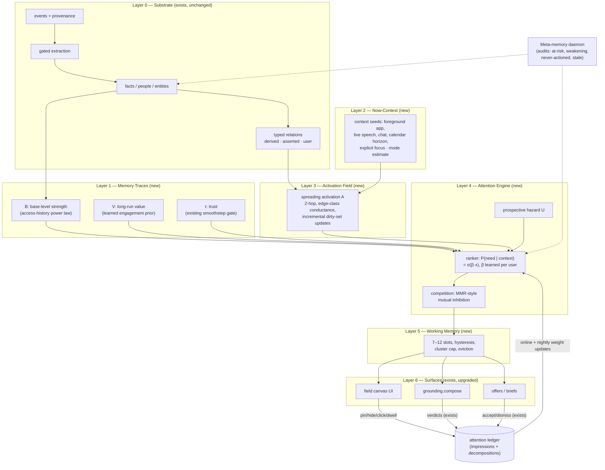
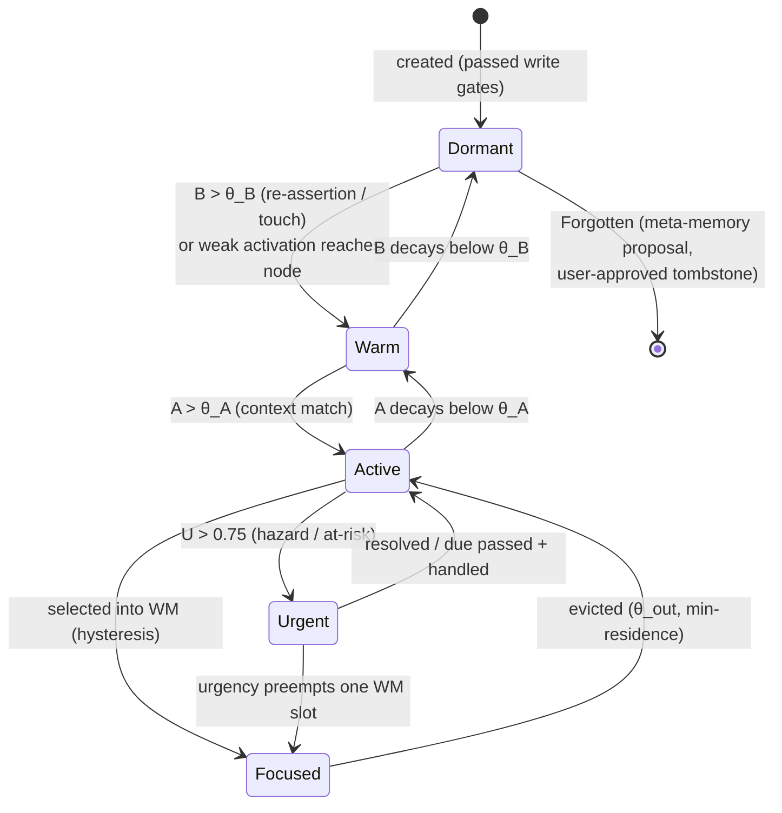
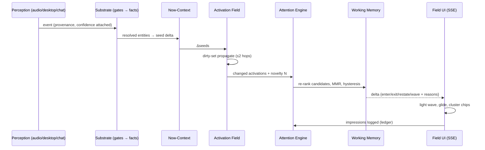
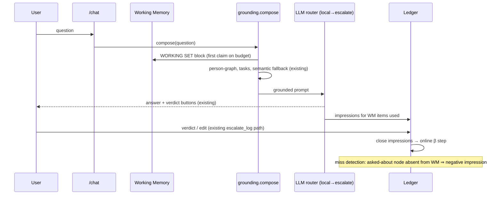

# The Attention Field

**Redesigning the Mnemos Memory Field as a cognitive attention engine**

*Design document · July 20, 2026 · status: pre-implementation design*
*Grounded against the shipped code in `nexus_v1` — every critique cites the file and line it describes.*

---

## 0. Thesis

The Memory Field today answers **"what is important?"** with a single number — `gravity` — computed per node from its own properties and the clock. That number is then projected into a ranked field of 12–40 nodes. This was the right first system: it established the philosophy (a ranked projection, not a graph visualization), it earned trust mechanics (provenance, confidence gating, golden tests), and it survived contact with real data (the open-work flood bug and its fix).

But it cannot become a cognitive attention system, because it is missing the defining property of attention: **attention is a function of context, and gravity is a function of nothing but the node and the clock.** `constellation()` takes one argument — `limit` (`app/services/graph.py:648`). The field renders identically at 9:00 a.m. two minutes before a meeting with Scott and at 11:30 p.m. mid-coding-session. Nothing the user is currently doing, saying, reading, or about to do enters the computation.

The redesign rests on four structural moves:

1. **Un-conflate gravity.** The current scalar fuses at least four quantities that human memory keeps separate: *memory strength* (how established a trace is), *momentary activation* (how relevant it is right now), *prospective urgency* (when it will matter), and *trust* (whether to believe it). These get separate variables, separate dynamics, and separate visual encodings — and only then get recombined by a ranker.
2. **Give the system a Now.** A continuously maintained **Now-Context** — built from signals the substrate already captures (foreground app activity, recent speech, chat, calendar) — seeds **spreading activation** through the existing typed graph. Same graph, different weights per moment: this single mechanism delivers dynamic relationships, goal conditioning, and contextual recall.
3. **Insert a Working Memory layer** between long-term memory and both consumers (the field UI *and* `grounding.compose()`). Today the constellation and chat grounding are two disconnected attention systems that can disagree about what matters. They become one.
4. **Close the feedback loop.** Mnemos already has the best feedback infrastructure of any layer of the product — verdict buttons, `agent_feedback`, the distill trail, a bench harness with promotion gates — and the ranking layer uses none of it. Ranking weights become *learned per user, on-device*, with the shipped heuristics as the prior. This directly addresses the known dormant gap: output-side feedback flowing back into models.

Everything else in this document is elaboration of those four moves, plus the engineering to make them incremental, explainable, calm, and safe.

**What this is not.** This is not an engagement engine. TikTok-class rankers optimize P(engagement); an attention prosthesis that does that becomes a slot machine welded to your own memories. The objective throughout is **P(user needs this next)** — need, not click — and every metric in §16 is chosen so that a *quieter, more often correct* field scores higher than a busier one.

---

## 1. What exists — a grounded inventory

The reader should know what is being redesigned. The shipped pipeline:

```
events (append-only, provenance chain in meta)
  → consolidation (utterances→turns→sessions; desktop→activities)
  → extraction (gated: intent pre-filter, span-faithfulness, confidence floor, dedup/supersede adjudication)
  → facts (task | commitment | claim; lifecycle: active/superseded/archived; review states)
  → typed graph rebuild (relations table; origins: derived | asserted | user)
  → memory gravity (score_gravity, GRAVITY knob table)
  → constellation projection (12–40 nodes, focus 7–12, type quotas, stable anchors)
  → canvas field UI (phyllotaxis + 56-iteration relax, glide diffs, evidence popover)
  → user feedback (pin / hide / link / reclassify / evidence)
  → graph updates (user-origin edges survive rebuild)
```

Key mechanics, verified in code:

- **The scorer** (`app/services/ranking/scorer.py`, knobs in `graph.GRAVITY`): `gravity = sigmoid(Σ wᵢ·termᵢ − 1.1) × decay × trust`, with ten weighted terms (`pin` 1.35, `pros` 1.55, `rel` 1.15, `fut` 0.95, `unres` 0.85, `cent` 0.70, `sem` 0.55, `rep` 0.45, `temp` 0.70, `unc` −0.80), per-kind exponential half-lives with floors (idea 14d/0.15 … default 90d/0.45), a 45-day recency horizon with novelty bumps (+0.25 under 1.5 days), and a smoothstep trust gate over confidence ∈ [0.20, 0.35] that pins bypass. Field v2 swaps only the Scorer (`FieldV2Scorer`: traces B̂/V̂ + activation); see §8.0.
- **Projection** (`graph.constellation` → `ranking.pipeline.run`): candidates = real people + real entities + open tasks/commitments; scored → WM/MMR selected → Admitter enforces ≥2 people and ≥3 entities via post-selection swaps (never an alternate path); edges deduped, styled by confidence, capped at `max(60, 2·total)`.
- **Spatial memory** (`graph.py:299–317`): people get stable polar anchors from an FNV-1a hash with avalanche mixing (a deliberate fix after sequential IDs collapsed onto one spoke); the renderer clamps people softly back to their anchor every layout.
- **The renderer** (`app/api/mnemos_ui.py:146–1070`): Canvas 2D, one-shot deterministic relaxation (not a live force sim), diff-based `update()` that glides survivors and rings newcomers, breath pulse on at-risk promises, `prefers-reduced-motion` respected, camera persisted.
- **Trust plumbing**: pins/hides/links/reclassify are `relations` rows with `origin='user'` that survive `rebuild()` (which wipes only `origin='derived'`); reclassification mutates the real tables, not a view (`app/storage.py:1374–1459`).
- **Explanation**: per-node `why` reason labels and an evidence popover that hydrates source event snippets. **Rank is auditable too (WS2):** Scorers emit `ScoreBreakdown` (components sum to total); `/field/state?explain=true` and `/graph/constellation/evidence` surface them; the constellation panel shows "Why is this here?" with muted segment bars and tappable evidence refs. `admitted_by=quota` is stated plainly.
- **Behavioral contracts**: `tests/test_mnemos_interface.py` — pins outrank peers, overdue commitments outrank stale ideas, low confidence is softly suppressed with no cliff, pins always reach focus, ≥2 people and ≥min entities survive noise floods, anchors stay well-distributed, temporal is a single channel.
- **Update model**: the UI polls `/graph/version` every 4 s (an aggregate COUNT/MAX token, `app/storage.py:1528`) and refetches the whole field on change. There is no push channel anywhere in the product; chat polls at 1 s, jobs at 2 s.
- **Adjacent systems the redesign will lean on**: the confidence contract and epistemic tiers (`app/services/confidence.py`), the unified action-readiness score with risk bands auto/offer/review/hold (`app/services/readiness.py`), the two-signal offer gate (`app/services/task_offer.py`), the distill/verdict trail (`app/services/escalate_log.py`, `data/escalate_distill.jsonl`), few-shot recall with a leave-one-out bench and promotion discipline (`app/services/few_shot.py`, `scripts/bench_text.py`), cognition telemetry (`app/services/cog_telemetry.py`), daily reflection with a review UI (`app/services/reflector.py`), an anticipation prototype (`app/services/anticipation.py`, off by default), read-only iCloud calendar sync (`app/services/icloud_calendar.py`), and the desktop activity rollup with multimodal joins (`activities.ctx_event_ids`).

### 1.1 What stays sacred

Five things in the current design are correct at the philosophical level and are preserved, not merely tolerated:

1. **Ranked projection, never graph visualization.** The field shows a *selection*, and selection is the product.
2. **Spatial memory.** People keep stable anchors across rebuilds. Human spatial memory is the cheapest retrieval index the user owns; the redesign strengthens this (per-node home positions for all kinds, not just people) rather than trading it for layout optimality.
3. **Trust is a gate, not a term.** Low-confidence material is suppressed multiplicatively and smoothly, and user pinning overrides the machine. This survives intact (§11).
4. **User edits are sovereign and durable.** `origin='user'` rows outlive every rebuild. In the redesign they also outweigh every learned signal (§12.3).
5. **Golden tests as behavioral contracts.** "Safe to retune against these" is exactly the right relationship between constants and invariants; the new engine ships with a superset of these contracts (§18).

Two product-level invariants also bind every choice below: **code stays general-purpose** (all personalization lives in data and learned weights, never in `.py` logic), and **no training required** (a brand-new user gets full value with zero labeling; all learning is passive).

---

## 2. Critique of the existing system

Each weakness is stated with its evidence and its consequence. These are not complaints; together they form the requirements list for the new architecture.

**W1 — One scalar conflates four cognitive quantities.**
`score_gravity` folds memory strength (decay half-lives), momentary salience (`temp`), prospective urgency (`pros`, `fut`), long-run importance (`cent`, `rel`, `sem`, `rep`), and trust into a single number (`graph.py:449–480`). Consequence: the system cannot express "well-established but currently irrelevant" (your co-founder during a dentist appointment) versus "weakly established but urgently relevant" (a stranger you're meeting in ten minutes). Both collapse to a mid-range gravity and the field can't tell them apart, explain them differently, or decay them differently.

**W2 — No context input, anywhere.**
The score is `f(node, now_clock)`. Confirmed absences in the codebase: no goal conditioning of retrieval, no time-of-day logic beyond recency, no use of the foreground app or current conversation in ranking, no predictive precomputation (the `anticipation.py` prototype is reactive, heuristic, and off by default). The product *captures* rich context — `activities` rows with app focus and multimodal joins, live turns, calendar events — and the ranking layer reads none of it. This is the single largest gap between the current system and an attention system.

**W3 — "Semantic" is a caste system.**
The `sem` term is a per-kind constant: person 0.55, project 0.40, tool 0.32, open work 0.35, else 0.20 (`graph.py:781–790`). It encodes "people matter more than tools" as a universal law. It is exactly the personalization surface the product needs ("some users think in people, others in projects") — frozen into code, in tension with the general-code invariant.

**W4 — Hand-tuned constants with a dormant learning loop.**
The 45-day horizon, five half-lives, `sqrt(rel)/4`, `sqrt(degree)/5`, `degree/12`, the 1.1 sigmoid offset, every weight in the GRAVITY table — all hand-set. Meanwhile the product already operates verdict buttons on every chat bubble, an `agent_feedback` table, an append-only distill trail, and a bench harness with leave-one-out evaluation and promotion gates. None of that signal reaches ranking. The infrastructure for learned ranking exists; only the wiring is missing.

**W5 — Quotas treat the symptom of missing competition.**
The flood bug (open work crowding out every project and tool) was patched with reserved focus slots: `min_people_in_focus=2`, `min_entities_in_focus=3` (`graph.py:371–375`, selection loop `835–885`). It works, and the regression test is good. But quotas are a static answer to a dynamic problem: they don't generalize (what floods next — `screen_extract` entities? document-mined claims?), they can't express "20 near-identical tasks should collapse into one cluster," and they hard-code a diversity policy that should emerge from *mutual inhibition* among similar items (§8). Keep the quota as a test invariant; stop using it as the mechanism.

**W6 — Rebuild-the-world updates.**
`graph.rebuild()` wipes all derived edges and recomputes from `list_facts(limit=100000)` plus `recent_turns(100000)` (`graph.py:95,126`); `constellation()` rescoring is full recompute per request; the UI discovers change by polling an aggregate version token every 4 s. Correct at 10⁴ rows; fails the brief's targets (millions of memories, sub-100 ms, streaming) by architecture, not by constant-tuning.

**W7 — Degree is double-counted and unnormalized.**
`cent = √degree/5` and `rep = degree/12` are two functions of the same variable (`graph.py:780,791`), and `co_occurs` weights accumulate forever via `ON CONFLICT weight = weight + excluded.weight` (`app/storage.py:1047`). Rich-get-richer: an entity prolific in April outranks one central to this week forever, because raw co-occurrence counts have no normalization (PMI or otherwise) and no recency. This is the classic popularity-bias failure recommender systems solved a decade ago.

**W8 — Silent priors.**
A node with no timestamp is scored as 21 days old (`graph.py:320–323`). A defensible default — but it is an invisible Bayesian prior injected into an unexplainable place. The new design makes every such default an explicit, inspectable model parameter.

**W9 — Explanations are labels, not accounts.**
The `why` list ("overdue commitment", "well connected") is generated by threshold checks *after* scoring (`graph.py:802–822`). It cannot answer *why now*, *what changed since yesterday*, or *why this and not that* — the three questions that actually build trust in an attention system. There is no stored decomposition to diff.

**W10 — Two attention systems that never talk.**
The constellation ranks nodes by gravity; `grounding.compose()` independently re-retrieves per chat message with regex gates (`_TASKY`, `_SCREENY`) and its own budgets (`app/services/grounding.py:191–282`). The field can foreground Scott while the chat answer about Scott is grounded on different material. Both are attention; there should be one attention state with two consumers.

**W11 — Prospective memory is a step function.**
Urgency comes in discrete jumps — no-due 0.45, <2d 0.85, <7d 0.55, else 0.25, overdue ramp (`graph.py:753–767`). Human prospective memory behaves like a hazard that rises smoothly as the window approaches, modulated by the cost of missing it. A commitment due in 8 days scores 0.25 today and 0.55 tomorrow with no explanation available for the jump (see W9).

**W12 — Nodes have lifecycle but no cognitive state.**
`facts.state` (active/superseded/archived) and task status exist, but there is no notion of dormant vs. warm vs. active, no consolidation, no principled forgetting — so the candidate pool is "everything not hidden," and every scoring pass pays for it.

**W13 — Edge semantics are decorative.**
Predicates (`responsible_for`, `promise`, `co_occurs`, `about`, `works_at`…) affect edge *style* and evidence text but not propagation of importance: gravity sums degree without regard to what kind of edge it is (`graph.py:678–689`). A promise edge and a mentioned-together edge are cognitively different objects and must conduct attention differently.

**W14 — The transport can't carry the experience.**
4-second version polling plus full refetch means the field reacts to reality with 4–20 s latency and re-transmits everything to change anything. The diff-based renderer is already excellent; it deserves a delta stream.

One meta-observation: **the substrate is not the problem.** Provenance chains, epistemic tiers, faithfulness gating, lifecycle columns, origin-separated edges — the memory layer below the field is genuinely strong, and stronger than most published personal-memory systems. Every change in this document is additive above `storage.py`; no existing table is altered or dropped (§14, §20).

---
## 3. The redesigned cognitive architecture

Seven layers. Layers 0 and 6 largely exist; 1–5 are new organs grown between them.



The essential dataflow property: **perception updates context, context updates activation, activation updates ranking, ranking updates working memory, and working memory is the single source of truth for every attention consumer.** Feedback from every consumer lands in one ledger, and the ledger trains one ranker.

### 3.1 Why each heuristic becomes learned, adaptive, or stays deterministic

The brief demands this be argued component by component. The governing principle is borrowed from the history of Google Search ranking: **hand-crafted signals, learned combination** — you learn the *weights* long before you learn the *features*, because weights are auditable, bounded, and cheap to train on small personal data, while learned features are none of those things on a single user's device.

| Component | Verdict | Why |
|---|---|---|
| Trust gate (smoothstep over confidence) | **Deterministic, unchanged** | Safety-critical, golden-tested, must be auditable and identical for every user. Learning it invites confidence-laundering. |
| Base-level strength B | **Fixed functional form, one learned exponent** | The power law of forgetting is one of the most replicated results in cognitive science; fit the decay exponent per kind within bounds, don't rediscover the law. |
| Spreading activation algorithm | **Deterministic propagation, learned edge-class conductances** | Propagation must be fast, stable, explainable. Which edge *types* conduct attention for *this user* is genuinely personal (bounded scalars, easy to learn). |
| Prospective urgency U | **Deterministic hazard form, learned lead times** | The shape (logistic rise into the deadline window) is not user-specific; how far ahead a user wants runway per kind/risk is. |
| Signal combination β | **Learned (Bayesian logistic, on-device)** | This is *the* personalization surface — it replaces the `sem` caste system and the GRAVITY weight table. Small parameter count, bounded, prior-anchored, replayable. |
| Kind-affinity multipliers | **Learned (Dirichlet-smoothed counts)** | Directly encodes "thinks in people vs. projects" from engagement distribution; trivially explainable ("you open people 3× more than tools"). |
| Mode inference | **Rules first, tiny classifier later** | Deterministic calendar/app rules cover ~80% and are explainable on day one; a naive-Bayes upgrade is optional and inspectable. Never a remote model. |
| Node selection / competition | **Deterministic (MMR-style)** | Diversity policy must be reproducible per frame and testable; the *similarity* it uses may come from embeddings, but selection itself is not stochastic. |
| Layout / spatial anchors | **Deterministic, strengthened** | Spatial memory is the user's asset. Optimizing layout per frame would vandalize it. |
| Exploration | **Bounded Thompson sampling on β only** | A little principled exploration prevents feedback-loop collapse (W7's cousin), but it perturbs *weights*, never fabricates *placement* — no "shuffled for engagement" dark pattern. |

---

## 4. Memory traces: strength, value, trust

Every attendable node (person, entity, open fact, and later document/idea clusters) gets a `node_dynamics` row (§14) holding three slow variables.

### 4.1 Base-level strength B — the forgetting curve done right

Replace per-kind half-life decay (a function of *creation* age) with ACT-R base-level learning (a function of *access history*):

```
B_i(t) = ln( Σ_{j=1..n_i} (t − t_j)^(−d_k) )        d_k ∈ [0.3, 0.8], per kind, default 0.5
```

where `t_j` are the node's **access events**: creation, re-assertion (`touch_fact` already exists and already bumps `updated_at` — it becomes an access), retrieval into grounding that survived dedup, inclusion in an accepted answer, evidence-popover open, pin, edit, and being the object of a user chat mention. Practical storage is the standard hybrid approximation: keep the most recent K=8 timestamps exactly plus `(n_older, t̄_older)` for the compressed tail:

```
B_i(t) ≈ ln( Σ_{j≤K} (t − t_j)^(−d) + n_older·(t − t̄_older)^(−d) )
```

O(1) memory per node, O(K) update. This single change fixes three current defects at once: recency and frequency stop being separate hand-weighted terms (`temp`, `rep`); a fact the user re-asserts weekly stays strong *because of its history*, not because of a 90-day constant; and "memory strength" becomes an honest, explainable quantity ("touched 6 times, last on Tuesday").

Cold start: a node with only a creation event degenerates to `B = −d·ln(age)` — a power-law version of today's decay, so day-one behavior is continuous with the shipped system. The existing per-kind floors survive as clamps on the *rendered* strength, not the ranked one.

### 4.2 Long-run value V — what mattering has meant before

`V_i ∈ [0,1]` is a slow exponential moving average of *engagement outcomes* attributable to the node: pinned (+strong), evidence opened with dwell (+), converted an offer or reflection into a task (+), answer grounded on it accepted (+, joins the existing `local_kept`/accepted distill rows), hidden (−strong), offers about it dismissed repeatedly (−). Onboarding seeds V: people, projects, and priorities named in the profile sheet start at V=0.6 instead of 0.35 — the profile finally influences ranking, not just existence.

V is what separates "your co-founder" from "a barista mentioned once" *even when both are equally inactive*. It deliberately moves slowly (half-life ≈ 60 days of engagement, not wall time) so that a two-week vacation does not demote your family.

### 4.3 Trust τ — unchanged

`τ = smoothstep(0.20, 0.35, confidence)`, pinned ⇒ 1.0, exactly as shipped (`graph.py:404–415`). It remains a multiplicative gate at the end of the pipeline, never a learnable weight. The golden tests covering it transfer verbatim.

---

## 5. The Now-Context

A small, continuously refreshed state object — the system's estimate of *what the user is inside of right now*:

```
Context = {
  seeds:    { (node_type, node_id) → weight ∈ (0,1] },   sparse, ≤ 64 entries
  mode:     one of the mode registry (§9) + confidence,
  horizon:  next 90 min of calendar (events, attendees→people, projects),
  focus:    explicit user focus target, if any (exists: double-tap focus),
  ts:       last update
}
```

**Seed sources — all already captured by the substrate:**

| Source | Exists as | Seed weight logic |
|---|---|---|
| Foreground app / window | `activities` rows (app, windows, `ctx_event_ids`) | app→entity links from `screen_extract` mining; weight decays exp(−Δt/20 min) |
| Live speech | turns/sessions with resolved people/entities | entities in settled turns, last 30 min |
| Chat | `chat.user` events, `_people_in` extraction (exists in grounding) | strongest signal; weight 1.0 on mention, τ=15 min |
| Calendar horizon | `icloud_calendar` sync (exists, read-only) | attendees and matched projects of events starting within 90 min ramp up as the event approaches — this is where "meeting with Scott in 10 minutes" enters |
| Explicit focus | field double-tap / focus mode (exists) | weight 1.0, TTL until cleared; always wins ties |
| Phone context | `phone.*` events | location is **not** currently captured; when the phone channel adds it, it becomes a seed source — flagged future, not assumed |

The context updater is event-driven (subscribes to the same bus the worker jobs use) plus a 60 s tick for calendar ramps. It is deliberately dumb: no LLM in the loop, pure resolution against existing people/entities via the shipped `resolution.py` cascade. Cost: microseconds per event.

**Privacy note:** the Now-Context never leaves the process and is never persisted verbatim; only hourly-bucketed snapshots (`context_snapshots`, §14) are stored for training and explanation, and those are prunable.

---

## 6. Spreading activation

Human recall works by association: activating "Scott" partially activates the fundraise, the term sheet, the promise you made him. The graph already encodes exactly these associations with typed, provenance-carrying edges — they're just inert at ranking time (W13).

### 6.1 The computation

Let `s` be the seed vector from Now-Context. Activation is two damped propagation steps over the normalized conductance matrix:

```
a⁰ = s
a¹ = α·s + (1−α)·Ĉᵀ a⁰          α = 0.6
a² = α·s + (1−α)·Ĉᵀ a¹
A_i = a²_i,  sparsified to top 256 nodes, floor ε = 0.01
```

`Ĉ` is row-normalized so activation is conserved (no node amplifies the field), with per-edge conductance:

```
c_e = g(class_e) · pmi_e · exp(−age_e / τ_edge) · conf_e
```

- `g(class)` — learned per-user conductance for each of ~6 edge classes: **obligation** (responsible_for, promise, committed, owed), **assertion** (works_at, member_of, part_of), **aboutness** (about, mentioned_in), **social** (co_occurs, associated_with), **provenance** (evidenced_by — conducts weakly by design), **user** (linked — conducts strongly by design). Bounded [0.1, 2.0], shipped priors: obligation 1.4, user 1.6, assertion 1.0, aboutness 0.8, social 0.7, provenance 0.3.
- `pmi_e` — pointwise-mutual-information normalization of the accumulated co-occurrence weight: `pmi = log((w_ij·W)/(w_i·w_j))`, clipped to [0,3], computed at rebuild. This is the direct fix for W7: an edge is strong because two things co-occur *more than their popularity predicts*, not because either is prolific.
- `exp(−age_e/τ_edge)` — edge recency (τ_edge = 45 d), using a new `last_seen` sidecar (§14) so re-observed edges refresh. Old friendships fade in conductance without being deleted.

### 6.2 Incrementality — the performance heart

Full recomputation is O(seeds × fanout²) and would be fine at today's scale, but the design target is millions of memories. The activation field therefore updates by **dirty-set propagation**: when a seed changes by Δ, only the ≤ `32·32` nodes within two hops of it (fan-out capped at 32 highest-conductance edges per node) are recomputed. Activation elsewhere decays passively — lazily, at read time — via `A_i(t) = A_i(t₀)·exp(−(t−t₀)/τ_A)` with τ_A = 10 min. Nothing iterates over the whole graph, ever, after boot.

Two time constants matter and are deliberately different: **seeds** decay on the 15–20 min scale (context drift), **activation** on the 10 min scale (thought trail). The combination produces the phenomenology the brief asks for: switch from coding to the phone call with Scott, and the coding cluster visibly cools over minutes while Scott's obligations warm — a *wave*, not a cut.

### 6.3 Visualization

Activation is the field's *light*. Waves are rendered literally: when a seed event fires, the renderer receives the dirty-set delta and animates a luminance ripple outward along the conducting edges (replacing the current arrival ring as the primary motion vocabulary; the ring remains for genuinely new nodes). Under `prefers-reduced-motion`, waves render as a crossfade. Nothing moves *positionally* during a wave — light changes, places don't (§19).

---

## 7. Prospective memory: urgency as hazard

Replace the step function (W11) with a logistic hazard per open fact:

```
U_i(t) = σ( (L_k,r − days_until_due_i(t)) / κ )          pre-due
U_i(t) = min(1, 0.75 + 0.04·min(14, days_overdue))        overdue (shipped ramp, kept — it's good)
U_i    = base_k · (1 + 0.15·(1 − conf))                   no due date (shipped logic, kept)
```

- `L_k,r` — lead time: how many days of runway this kind × risk class deserves. Shipped priors: commitment/high-risk 5 d, commitment 3 d, task 2 d. **Learned per user within [1, 10]** from when they historically start engaging with due items (the impressions ledger makes this measurable).
- `κ = L/3` sets the steepness so urgency is ~5% at 2L days out and ~95% at due.

Additionally, urgency is *escalated by silence*: the meta-memory daemon (§13) computes a no-progress flag — an open commitment whose owner has produced no related evidence in the last `L` days gets `U ← max(U, 0.8)` with an explicit "at risk: no movement" reason. That is prospective memory doing what it is for: not remembering the deadline, but noticing the drift toward missing it.

---

## 8. The Attention Engine: ranking and competition

### 8.1 Candidate generation, then ranking

The two-stage pattern every serious recommender converged on, applied to memory:

- **Candidate set** = nodes that are *mentally available*: `state ≥ Warm` (§10) ∪ `A > ε` ∪ `U > 0.3` ∪ pinned ∪ in current WM. At steady state this is hundreds to low thousands of nodes regardless of substrate size — the ranked world stays small even when the remembered world is huge. Millions of dormant memories cost nothing per frame; they re-enter through activation (an edge from a seed), re-assertion (extraction touch), or search.
- **Ranking** over candidates only:

```
x_i  = [ B̃_i, Ã_i, U_i, N_i, V_i, sim(e_i, e_ctx), kind_affinity_k(i), pin_i ]
p_i  = σ( β · x_i )                      # P(need_i | context), calibrated
score_i = p_i · τ_i                      # trust gates, never trades off
```

`B̃, Ã` are z-scored within the candidate set per frame (so β stays scale-stable), `N_i` is novelty/surprise (below), `sim(e_i, e_ctx)` is embedding similarity between the node and a mean-pooled context embedding (the existing MiniLM embedder and Lance index — no new ML runtime), and `kind_affinity` is the learned per-kind multiplier vector (§12.4). Pinned nodes bypass to score 1.0, as today.

**Novelty/surprise** `N_i` replaces the age-bump hack (+0.25 if < 1.5 d): it fires on *information*, not on youth:

```
N_i = τ_source · (1 − max_cos(e_new_evidence, evidence_centroid_i)) · exp(−Δt/48h)
```

A tenth repetition of a known fact produces no surprise however recent; a contradiction or a first-ever claim about a dormant person produces a lot. This is the predictive-processing principle operationalized: attention flows to prediction error, weighted by source trust so a garbled ASR fragment can't manufacture surprise.

### 8.0 Unified ranking pipeline (shipped)

Focus selection is a single pipeline with pluggable stages — never three competing paths:

```
candidates → Scorer → Selector → Admitter → FocusSet
```

| Stage | Module | Role |
|-------|--------|------|
| **Scorer** | `app/services/ranking/scorer.py` | Emits per-node `ScoreBreakdown` (components sum to total). `GravityScorer` = shipped heuristics; `FieldV2Scorer` = traces + spreading activation. **`QUILL_FIELD_V2` selects only the Scorer** — same pipeline structure either way. Mode kind-multipliers apply inside the Scorer via `PipelineContext.mode`. |
| **Selector** | `app/services/ranking/selector.py` → `working_memory.select_focus` | MMR diversity, hysteresis, cluster collapse. `QUILL_WM=0` ⇒ pure top-k by score (kill-switch); Admitter still runs. |
| **Admitter** | `app/services/ranking/admitter.py` | Post-selection constraint: if focus violates ≥2 people / ≥3 entities, swap lowest-marginal-score non-pins and set `admitted_by=quota`. Quotas are never an alternate selector. |

`graph.constellation()` assembles candidates + features, then calls `ranking.pipeline.run()`. `/field/state` remains the canonical read; `/graph/constellation` stays a thin adapter. Constants (`FOCUS_CHURN_K=2`, quota mins, breakdown ε, aging thresholds, snapshot retention) live in `ranking/config.py`. Golden snapshots: `tests/fixtures/ranking_corpus/goldens/`.

**Time (WS3):** on each material `memory_version` bump, `/field/state` persists a lightweight `field_snapshots` row (`focus_ids`, `periphery_ids`, per-node gravity). `GET /field/diff?since=` (default: start of today) returns `entered_focus` / `left_focus` / `rising` / `falling` / `aging`. Open commitments gain an `aging` score component and resist decay so neglect raises gravity. The sky shows a single warm-amber aging halo; a "Since yesterday" toolbar mode layers entrance emphasis + hover drift arrows without re-layout jank.

**Margin + modes (WS4):** Margin notes are typed `{text, kind, action?, refs}` from the backend — never hand-assembled in the UI. Hovering a note soft-highlights its `refs` in the constellation; tapping runs `action.route` or `action.command` (emphasize / compare / open readiness or approval). Mode chips set the Scorer context vector (kind reweight); they do not filter. Caption under chips: `Ranking for: Coding`. Auto = infer from calendar/activity.

**Incremental rebuild (WS5):** Extraction marks `graph_dirty`. `rebuild(scope="dirty")` clears and re-derives only derived edges incident to dirty ∪ 1-hop; `scope="full"` remains the nightly backstop. User and asserted edges are never touched. Instrumented with `duration_ms` + dirty-set size.

### 8.2 Competition: inhibition + Admitter quotas

Selection into focus/WM is sequential with **MMR-style mutual inhibition**:

```
pick argmax_i [ score_i − γ · max_{j ∈ selected} sim(i, j) ]      γ = 0.35
```

where `sim` blends embedding similarity and graph adjacency (same cluster of near-duplicate tasks ⇒ high sim). Twenty similar open tasks now compete with *each other* — the strongest is selected, and it suppresses its siblings, which surface as a countable cluster chip ("+7 related") rather than seven separate stars. Biased competition (the neuroscience) and maximal marginal relevance (the IR algorithm) are the same idea.

**Quotas as Admitter (not a fork):** after MMR selection, the Admitter may swap lowest-score non-pins to satisfy ≥2 people / ≥3 entities under a task flood. Swapped-in nodes carry `admitted_by=quota` so explainability stays honest. The diversity contract remains; the old `QUILL_WM=0 → quota-as-selector` path is gone.

An **attention budget** shapes the rendered field: prominence is allocated by temperature softmax over selected scores (Σ prominence is constant), so the field cannot get uniformly louder as life gets busier — brightness is zero-sum, like attention.

### 8.3 Calibration and hysteresis

- `p_i` is calibrated monthly by isotonic regression against realized engagement from the ledger, so "0.8" means something (§16 tracks ECE).
- WM entry/exit uses **hysteresis**: enter at `score > θ_in`, exit only below `θ_out = 0.7·θ_in`, minimum residence 90 s except on explicit context switch. The field must never flicker; churn is a first-class metric with a *budget* (§16), because calm is a correctness property of this product, not an aesthetic.

---

## 9. Goal conditioning: modes and dynamic relationships

One mechanism serves both requirements. A **mode** is a named reweighting of the attention pipeline:

```
mode m = { edge-class conductance multipliers g_m(class),
           kind multipliers k_m(kind),
           urgency lead-time multiplier,
           WM capacity bias,
           quiet flag }
```

**Registry (shipped defaults, self-serve editable):** Meeting, Writing, Coding, Research, Planning, Errand, Off/Family (quiet: field dims to pins + urgent-only). These are *personal* modes; the existing `browser_agent/modes.py` registry (email/calendar/shopping execution policies) is a sibling pattern, not the same object — the UI mode chip pattern (`routes.py:3339`) is reused, the semantics are new.

**Inference, deterministic first:** calendar event now → Meeting (with the event's attendees/projects as boosted seeds); foreground app class (IDE→Coding, docs editor→Writing, browser+reading pattern→Research) from the `activities` rollup; hour-of-week prior as tiebreak. Manual selection via the mode chip always wins, TTL 2 h. A tiny naive-Bayes upgrade over (app class, calendar class, hour) is a later, optional, on-device refinement.

**The Scott example, mechanically:** today, in Meeting mode with the "Series A" event on the horizon, Scott's seeds arrive via calendar; obligation and assertion edges conduct at ×1.3; the fundraise project, the term-sheet commitment, and the intro he promised light up. Tomorrow, in Coding mode, Scott is seeded (if at all) by a mention in the repo; social edges conduct at ×0.7, aboutness at ×1.2, and the same Scott node pulls the architecture doc he commented on instead. **Same graph, same edges, different conductances** — relationships are dynamic because conduction is contextual, not because the graph mutates.

---

## 10. Memory states

Two orthogonal axes, deliberately:

- **Lifecycle** (already exists in the substrate): `open / resolved / superseded / archived` — from `facts.state`, task/commitment status, `review`. The redesign adds only `forgotten` (a tombstone the ranker honors absolutely; §11).
- **Attention state** (new, derived from B, A, U, WM membership — stored for cheap candidate filtering, recomputed lazily):



**Prospective** is a *flag*, not a position in this chain: any state may carry `prospective=true` (has a future window), which routes it into the hazard computation and the predictions surface. Modeling it as a sequential state was considered and rejected — a dormant commitment due in 60 days is both dormant and prospective, and forcing an ordering would misrepresent one axis or the other.

Half-lives fall out of the dynamics rather than being set per state: Focused→Active in minutes (WM eviction), Active→Warm ≈ 10 min (τ_A), Warm→Dormant on the B power law (weeks–months by kind and history). The candidate generator reads attention state as an index (`state ≥ Warm`), which is what makes ranking O(candidates) instead of O(nodes).

**Visual language** (§19 details): Dormant is *absent* — the field's most important rendering decision is what it refuses to render. Warm = faint, small, at rest position. Active = lit, normal. Focused = inner ring, full label. Urgent = the existing breath pulse, reserved exclusively for this state so the vocabulary stays honest. Resolved nodes take a one-frame bow (brief settle animation) and leave — closure is shown, not just deletion.

---

## 11. Working Memory

The WM layer is the contract between attention and every consumer.

- **Capacity:** 7–12 item slots (matching today's `focus_k` — the shipped range accidentally lands on the right cognitive number) with a harder constraint of ≤ 4 *clusters* (Cowan's limit): items sharing a dominant edge or high mutual similarity count as one cluster with a named head. The field's focus ring and the grounding block both read this structure.
- **Admission:** by ranked score through hysteresis (§8.3). Urgent state may preempt exactly one slot. Pins occupy slots outside the competition (as today: pinned always in focus).
- **Eviction:** lowest `score_i · residence_decay − staleness_boredom`, where boredom grows for items that have sat in WM without any engagement for > 30 min — a slot is too expensive for furniture. Evicted ≠ demoted: it returns to Active and can re-enter without penalty after context shifts.
- **Goal conditioning:** mode multipliers apply *before* admission, so WM composition swings with mode — this is task switching made visible and bounded.
- **LLM integration:** `grounding.compose()` gains a **WORKING SET block, first after identity/profile** — the WM items with their one-line whys — before the existing person-graph/tasks/semantic sections, inside the same `_MAX_BLOCK_CHARS` budget (WM gets ~40%, floors preserved for identity). Retrieval doesn't get worse when WM is wrong: the semantic fallback still runs; WM just gets first claim on the budget. One attention state, two consumers — W10 closed. The same block feeds the planner's `select_context` (which today re-derives context its own way, `agent_planner.py:371`).
- **Persistence:** `wm_slots` (§14) survives restart — the assistant that "was just thinking about" the fundraise still is after a reboot, and can say since when, and why.

## 12. Personalization and the learning loops

### 12.1 What is learned (complete list)

β (8–12 combination weights), g(edge-class) conductances (6), kind-affinity vector (7), lead times L_k,r (~6), decay exponents d_k (5, tightly bounded). Total: **under 40 scalars**. This is a deliberate ceiling: forty bounded, prior-anchored, individually explainable numbers — not an embedding tower. A personal attention model must be small enough to *show to its owner*.

### 12.2 Signals → ledger

Every surfacing of a node to any consumer writes an **impression** with its score decomposition; every user reaction closes it:

| Signal | Strength | Already exists as |
|---|---|---|
| Pin / hide / reclassify | strong ± | constellation ops (`origin='user'` rows) |
| Evidence open + dwell > 3 s | medium + | popover (needs dwell timing added) |
| Offer accepted / dismissed | strong ± | `task_offer` telemetry + `agent_feedback` |
| Chat verdict on grounded answer | medium ± | verdict buttons → `escalate_log.set_user_outcome` |
| Grounded fact appears in accepted answer | weak + | distill rows join (`local_kept` / accepted) |
| WM item clicked / ignored a full session | weak ± | new (ledger) |
| Reflection insight approved / converted | medium + | `reflection_items.review` |
| Search/ask for something NOT surfaced | strong − (a miss) | joinable: chat queries vs. ledger contents |

The last row is the precious one: **misses are the ground truth engagement metrics can't see**, and this product can measure them because the chat and the field share a substrate.

### 12.3 Online learning (on-device, continuous)

Bayesian logistic regression on β with diagonal Laplace posterior; per closed impression: one SGD step on `(x_i, engaged)`, learning rate 0.02, L2-anchored to the shipped prior; **Thompson sampling** draws β̃ ~ posterior once per WM rebuild (not per node) for mild, coherent exploration. Guardrails: per-weight bounds ([0, 2×prior] for monotone signals), max daily drift ‖Δβ‖ ≤ 5%, user edits (pin/hide) applied with 10× weight and, above all, honored *directly* in the field regardless of model opinion — sovereignty first, learning second. Kill switch: `QUILL_ATTENTION_LEARN=0` freezes weights at prior.

### 12.4 Cold start and the archetype question

Day one: shipped priors = the current GRAVITY table translated into β (a continuity mapping is part of migration §20, so v2 with priors ≈ v1 behavior — this is testable and is the promotion gate for the cutover). Onboarding profile seeds V and initial kind-affinity: a profile that lists mostly people tilts the Dirichlet prior toward person-affinity; mostly projects, project-affinity. Thereafter kind-affinity updates as Dirichlet-smoothed engagement counts — after two weeks the system can *say* "you engage with people 3.1× more than tools; the field leans accordingly," which is the archetype personalization the brief asks for, in one sentence, with no training required from the user.

### 12.5 Offline learning (nightly, on-device)

The Phase-2 bench discipline (`scripts/bench_text.py`) extends to ranking: nightly, replay the last 30 days of ledger impressions through candidate β variants; report NDCG@12, miss rate, calibration ECE, churn; **promote only if golden behavioral contracts pass and replay metrics don't regress** — the same promote-or-hold gate the text router already uses. Fitted artifacts live in `ranking_model` rows (versioned, revertable, exportable). Long-term (research roadmap): distill the ledger into the Phase-3 LoRA loop so the *local text model* also internalizes what this user attends to.

### 12.6 Privacy

Everything above runs on-device: ledger, context snapshots, weights. Nothing new leaves the machine — Claude escalation continues to see only what grounding already sends, under existing consent patterns (the `documents.scan` explicit-consent flow is the template). The model file and ledger are exportable and deletable from the console; deleting them reverts to shipped priors. Impressions retain 90 days then compress to per-node counters.

---
## 13. Predictive memory and meta-memory

### 13.1 Prediction: the next hour

A lightweight predictor answers "P(node needed within 60 min)" ahead of the ask:

- **Features:** calendar horizon (dominant — the next event's people/projects), per-node hour-of-week access histograms from the ledger (attention has rhythm: the standup project crests Mondays at 9), app-transition patterns (the `anticipation.py` A→B heuristic, promoted from reactive to anticipatory), cresting hazards (U rising through 0.5), and day-boundary effects (morning = yesterday's unfinished WM).
- **Model:** the same logistic ranker evaluated against the *predicted* context (calendar-projected seeds instead of current seeds). No second model to maintain — prediction is ranking against a future Now-Context.
- **Cadence:** recomputed on calendar change and every 5 min in the last 90 min before an event; idle otherwise. Pure CPU, milliseconds.
- **What predictions do:** (1) pre-warm WM candidates so a context switch is instant; (2) drive the *Horizon* strip in the UI ("in 40 min: Scott — term sheet, your intro promise, his daughter's name"); (3) trigger prepared briefs through the existing planner path (`MeetingCompiler` already builds meeting briefs — it gains a caller). Predictions never act: acting remains governed by the readiness bands and the two-signal offer gate, unchanged.
- **Failure containment:** a wrong prediction costs one strip entry, visibly labeled "expected next" with its reason. Dismissing it is a strong negative signal to the ledger. Prediction confidence below 0.5 renders nothing — silence beats noise (the substrate's "prefer silence" principle, inherited).

### 13.2 Meta-memory: the auditor

A nightly daemon (extends `reflector.py`, same review UI, new item kinds) that reasons *about* the memory rather than *from* it:

| Audit | Detection | Output kind |
|---|---|---|
| Commitment at risk | open, hazard cresting, no related evidence in L days | `risk` (exists) + urgency escalation §7 |
| Weakening relationship | co_occurs edge `last_seen` slope negative over 60 d for high-V person | `relationship_update` (exists) |
| Conversation never actioned | session with actionable-intent turns but no fact/packet descended from it (provenance join) | new: `dropped_thread` |
| Abandoned idea | idea node, B below dormancy for 30 d, V > floor | new: `fading_idea` |
| Unanswered question | question-intent turn with no answer evidence in following sessions | new: `open_question` |
| Staleness | fact whose newest evidence exceeds kind freshness (contact info 180 d, project status 14 d) | new: `stale_fact` |
| Forgetting proposals | dormant, V≈0, τ low, no user edits ever | new: `forget_candidate` → user-approved tombstone |

Every audit output is grounded in fact/event IDs (the reflector's `_ground` guard pattern), reviewable, convertible to a task, and — critically — **feeds ranking**: `risk` escalates U; `fading_idea` grants a one-shot novelty pulse ("resurfacing before it's gone" — the field's version of reconsolidation); `forget_candidate` approval writes the tombstone the candidate generator honors. "What should be remembered but wasn't" already has an organ — self-quiz failure rows; they join the same review stream.

---

## 14. Data structures and schema additions

All additive; no existing table is modified (migration adds columns nowhere). SQLite throughout — no new storage engine is needed at this scale (§15).

```sql
CREATE TABLE node_dynamics (          -- one row per attendable node
  node_type TEXT NOT NULL,            -- person|entity|fact
  node_id   INTEGER NOT NULL,
  B REAL NOT NULL DEFAULT 0,          -- base-level strength (log space)
  V REAL NOT NULL DEFAULT 0.35,       -- long-run value EMA
  A REAL NOT NULL DEFAULT 0,          -- last computed activation (cache)
  A_ts REAL,                          -- for lazy decay
  U REAL NOT NULL DEFAULT 0,          -- last hazard
  att_state TEXT NOT NULL DEFAULT 'dormant',  -- dormant|warm|active|focused|urgent
  prospective INTEGER DEFAULT 0,
  access_recent TEXT,                 -- json: last 8 access timestamps
  access_n_older INTEGER DEFAULT 0,
  access_t_older REAL,                -- mean ts of compressed tail
  home_x REAL, home_y REAL,           -- spatial memory for ALL kinds (extends person anchors)
  updated_at REAL,
  PRIMARY KEY (node_type, node_id)
);
CREATE INDEX idx_nd_state ON node_dynamics(att_state);

CREATE TABLE attention_impressions (  -- the ledger
  id INTEGER PRIMARY KEY AUTOINCREMENT,
  ts REAL, node_type TEXT, node_id INTEGER,
  surface TEXT,                       -- field|grounding|offer|brief|horizon
  score REAL, p_need REAL,
  decomposition TEXT,                 -- json: {B,A,U,N,V,sim,affinity,beta_version}
  context_id INTEGER,                 -- fk context_snapshots
  outcome TEXT,                       -- pin|hide|click|dwell|accept|dismiss|used|ignored|miss
  outcome_ts REAL
);
CREATE INDEX idx_ai_node ON attention_impressions(node_type, node_id, ts);

CREATE TABLE context_snapshots (
  id INTEGER PRIMARY KEY AUTOINCREMENT,
  ts REAL, mode TEXT, mode_conf REAL,
  seeds TEXT,                         -- json, hourly-bucketed, pruned with ledger
  calendar_next TEXT, app TEXT
);

CREATE TABLE wm_slots (
  slot INTEGER PRIMARY KEY,           -- 0..11
  node_type TEXT, node_id INTEGER,
  entered_at REAL, score REAL,
  cluster_head INTEGER DEFAULT 0, cluster_n INTEGER DEFAULT 1,
  reason TEXT                         -- json: top-3 contributions, human-rendered on demand
);

CREATE TABLE ranking_model (
  id INTEGER PRIMARY KEY AUTOINCREMENT,
  version TEXT, weights TEXT,         -- json: beta, g_class, kind_affinity, lead_times, d_k
  posterior TEXT,                     -- json: diagonal variances
  calibration TEXT,                   -- json: isotonic knots
  trained_at REAL, metrics TEXT, active INTEGER DEFAULT 0
);

CREATE TABLE edge_dynamics (          -- sidecar; relations table untouched
  relation_id INTEGER PRIMARY KEY,    -- fk relations.id
  last_seen REAL, pmi REAL, conductance REAL
);

CREATE TABLE attention_predictions (
  id INTEGER PRIMARY KEY AUTOINCREMENT,
  ts REAL, horizon_min INTEGER,
  node_type TEXT, node_id INTEGER,
  p REAL, reason TEXT, outcome TEXT   -- confirmed|unused|dismissed
);
```

In-memory (process singletons, rebuilt on boot from the tables): sparse adjacency with per-edge conductance (top-32 per node), the seed vector, the candidate set as a heap keyed by score. At 10⁵ edges this is a few MB.

## 15. APIs, transport, performance

**New endpoints** (existing `/graph/constellation*` kept as a thin adapter during migration):

| Route | Purpose |
|---|---|
| `GET /field/state` | full field: nodes (with att_state, decomposition ref, cluster info), edges, WM, mode, horizon strip |
| `GET /field/stream` | **SSE** — deltas: `{enter, exit, restate, wave, wm, mode}` events; heartbeat 15 s; the 4 s version poll remains as fallback for degraded environments |
| `GET /field/why/{type}/{id}` | explanation object (§17): contributions, delta vs. last render, nearest excluded competitor |
| `POST /field/feedback` | impression outcomes (click, dwell, dismiss) |
| `POST /field/mode` | manual mode set/clear (self-serve; also in UI chip) |
| `GET /field/predictions` | horizon strip contents with reasons |
| `GET /console/attention` | learning transparency: current weights vs. priors, drift history, calibration curve, kill switch |

**Performance budgets** (targets from the brief, with the mechanisms that meet them):

| Path | Budget | Mechanism |
|---|---|---|
| Seed event → activation delta | < 5 ms | dirty-set propagation, fan-out cap 32, 2 hops |
| Re-rank candidate set | < 20 ms @ 2k candidates | 12-float dot products + MMR over ≤ 40 |
| Event → field paint | < 250 ms | SSE delta + existing diff renderer (glide, no relayout for light changes) |
| Interaction (hover/click/pan) | < 100 ms | already met — canvas-local, unchanged |
| Substrate scale | 10⁶ memories | candidate-set architecture: dormant rows are never iterated; Lance handles semantic recall as today |
| Field stability | churn budget | ≤ 4 node enter/exits per minute rendered; excess queues (calm is enforced, not hoped for) |

Layout: node *positions* remain deterministic and home-anchored (now for all kinds via `home_x/home_y` — spatial memory extended, W-sacred #2); scores change light and size, not geography. A node moves home only on explicit re-cluster with an animation and a ledger entry ("moved because you linked it to Atlas").

### 15.1 Sequence: perception → field



### 15.2 Sequence: question → answer → learning



---

## 16. Evaluation

The metric suite is chosen so that *quiet and right* beats *busy and plausible*:

| Metric | Definition | Source |
|---|---|---|
| Attention precision@12 | engaged / surfaced in WM per session | ledger |
| **Miss rate** (primary) | user asked/searched for a node not in WM at ask time | chat–ledger join |
| Time-to-need coverage | fraction of engaged nodes that were in WM ≥ 5 min before engagement | ledger + predictions |
| Prediction hit rate | horizon items engaged within window / shown | attention_predictions |
| Interruption cost | offer dismissal rate (exists), horizon dismissals | task_offer telemetry |
| Calibration ECE | |p_need − realized| binned | ledger |
| **Churn** (calm) | node enter/exits per hour; must stay under budget | field deltas |
| Explanation acceptance | "why" views not followed by hide | ledger |
| Replay NDCG@12 | offline, per candidate weight vector | nightly replay |
| Commitment saves | at-risk audits that got action before due | meta-memory + facts |

Golden behavioral contracts (all existing ones preserved, plus): hysteresis-no-flicker (same context twice ⇒ identical WM), inhibition-diversity (the 20-task flood test passes *without* the quota code path), context-shift responsiveness (seed swap ⇒ ≥50% WM turnover within 2 min simulated), priors-continuity (v2 at shipped priors ≈ v1 top-12 with Kendall τ ≥ 0.6 on replay corpora), sovereignty (hidden never resurfaces; pinned never leaves; tombstones absolute).

## 17. Explainability and trust

Every surfaced node can answer four questions, from stored data, deterministically (no LLM required; the local model may *phrase*, never *decide*):

- **Why am I here?** Top-3 contributions from the impression decomposition, rendered by template: "promise to Scott · due in 3 days (urgency 0.82) · Scott is in your 2:00 meeting (context)".
- **Why now?** Diff of decomposition vs. this node's previous impression: "urgency +0.31 since yesterday; context match new (calendar)".
- **What changed?** The ledger is an append-only history per node; the evidence popover gains a small timeline.
- **Why not X?** For any hidden/absent node the user asks about: its current decomposition vs. the weakest WM member — "outscored by [term-sheet review]: less urgent (0.1 vs 0.8), not in current context." This is the single highest-trust feature in the design: the system will show its work *for the negative case*.

Trust mechanics carried forward and extended: confidence renders as dimness (never size — size is need, light is belief); superseded chains are shown as strikethrough lineage in evidence (the adjudicator's `update` verdicts finally get UI); conflicts (two active contradictory claims) surface as a paired card with one-tap keep/supersede; corrections are 10×-weighted learning events and immediate field mutations; forgetting is visible (forget proposals are reviewed, never silent) and reversible for 30 days (tombstone → archive). The learning system itself is inspectable at `/console/attention`: current weights against shipped priors, in plain language ("deadlines matter 1.4× more to you than average"), with one button back to defaults. **An attention system earns trust exactly as fast as it can explain itself, and no faster.**

## 18. Testing strategy

1. **Pure-math unit layer** — B, A propagation, U hazard, MMR, calibration are pure functions (the `score_gravity` discipline, kept): property tests (monotonicity, conservation of activation, bounds).
2. **Golden behavioral contracts** — §16 list, in `tests/` beside the existing `GravityGoldenTests`, run against both engines during migration.
3. **Replay harness** — deterministic re-scoring of recorded ledgers (the `bench_text.py` pattern); CI gate for weight promotion.
4. **Synthetic day simulator** — scripted personas (meeting-heavy PM day, deep-work coding day, mixed) emitting event streams; asserts field trajectories (Scott warms before the meeting; coding cluster cools during the call; churn stays under budget). This catches dynamics bugs no snapshot test can.
5. **UI contract tests** — SSE delta application idempotence; reduced-motion paths; decomposition rendering.
6. **Kill-switch drills** — learning off, SSE down (fallback to polling), empty DB (day-one), corrupted model row (revert to priors) — each has a defined degraded mode and a test.

## 19. UI philosophy

The field should feel like **a sky, read at a glance** — most of it dark, a few constellations lit, one region glowing where you are, weather moving through when the world changes.

- **Selection is the aesthetic.** The strongest visual decision remains what is *not* rendered. Dormant is absent. The empty field on a quiet Sunday is a feature — it says *nothing needs you*.
- **A stable geography, changing light.** Places persist (home anchors, all kinds); relevance is luminance, focus ring membership, and label weight. Users navigate by place; the system speaks in light. No force-directed jitter, ever.
- **Motion is meaning, and only meaning.** The vocabulary is complete and closed: *wave* = context shift propagating; *glide* = rank change; *ring* = genuinely new; *pulse* = urgent (reserved); *bow* = resolved. Anything else is decoration and is cut. Reduced-motion swaps all of it for crossfades.
- **Clusters, not crowds.** Sibling items render as one head with a count chip ("+7 related"); tapping unfolds them *in place*, inside the head's slot — the folding is how inhibition looks.
- **The Horizon strip** (top edge, ≤3 items): what's expected next and why, each dismissible. It is the only place prediction is allowed to speak.
- **The mode chip** names the current mode; tapping it is the whole goal-conditioning UI. Off/Family mode dims the field to pins and urgent-only — the system demonstrating it knows when not to exist.
- **Language over chrome.** Explanations are one calm sentence, not meters. No dashboards, no gauges, no scores shown as numbers anywhere in the field (numbers live in the console for the curious).
- Existing craft is retained: camera persistence, evidence popover, edit mode, keyboard map, the diff renderer's glide.

The feeling to protect: *my AI knows what matters and can say why* — attention with an explanation is care; attention without one is surveillance.

## 20. Migration plan

Strictly additive, five phases, each shippable and reversible; `QUILL_FIELD_V2` gates the cutover (the config-flag pattern used product-wide).

- **Phase 0 — Instrument (no behavior change).** Create ledger + context_snapshots; log impressions/decompositions from the *current* scorer (its terms are already computed at `graph.py:746–800` — write them down); add dwell timing to the evidence popover; start the chat-miss join. Training data accumulates from day one. *Risk: none.*
- **Phase 1 — Traces.** Backfill `node_dynamics` (B from `updated_at`/`extracted_at` history + touch counts; V from onboarding profile + pins). Shadow-compute the decomposed score alongside gravity; nightly replay compares. Priors-continuity contract must pass before Phase 2.
- **Phase 2 — Context and activation.** Now-Context service on the event bus; edge_dynamics sidecar (PMI + last_seen) computed in `rebuild()`; activation field with dirty-set updates; `/field/state` + SSE beside the old endpoints. Field V2 behind the flag, default off; golden tests run against both engines.
- **Phase 3 — One attention.** WM layer; `grounding.compose` WORKING SET block; planner `select_context` reads WM; MMR replaces the quota code path (quota tests stay green as invariants); flag default on; old constellation endpoint becomes an adapter over `/field/state`.
- **Phase 4 — Learning and horizon.** Online β updates + Thompson sampling; nightly replay/promotion; predictions + Horizon strip + meta-memory audits (new reflector kinds). `/console/attention` transparency page. Old scorer deleted after 30 clean days; golden tests keep the contracts it died honoring.

## 21. Failure cases and their containment

| Failure | Containment |
|---|---|
| Feedback loop (field shows X → user clicks X → X entrenches) | PMI normalization, exploration, boredom eviction, miss-rate as primary metric (misses punish narrowness) |
| Mode misinference | modes only reweight (never gate), chip always visible, manual override wins 2 h, low-confidence mode = neutral weights |
| Activation storm (hub node floods field) | row-normalized conductance (conservation), fan-out cap, provenance-class conducts 0.3, churn budget queues renders |
| Oscillation/flicker | hysteresis + min residence + churn budget (tested) |
| Wrong prediction embarrasses | horizon is labeled, capped at 3, silent under 0.5 confidence; dismissal trains it |
| Learned weights drift into nonsense | bounds, prior anchor, daily drift cap, replay promotion gate, one-tap revert |
| Cold/empty DB | priors reproduce v1 behavior; field renders onboarding seeds; no learning until ledger has ≥ 200 closed impressions |
| Creepiness ("how did it know?") | every surfaced item answers "why" from its ledger row; prediction reasons always name their source (calendar, rhythm, deadline) |
| SSE unavailable | 4 s version-poll fallback retained indefinitely |
| Clock skew / restart | WM persisted with entered_at; B uses absolute timestamps; activation cache decays lazily, never trusts uptime |

## 22. Research roadmap (2–5 years)

- **Reconsolidation:** retrieval as a write — each recall re-encodes the trace with current context, letting old memories acquire new associations (the `fading_idea` resurface pulse is the v1 seed of this).
- **Episodic future thinking:** compose predicted contexts several days out and simulate the field against them ("Thursday looks overcommitted") — planning as imagination over the same engine.
- **Sleep:** nightly consolidation grows from replay-and-refit toward the Phase-3 LoRA loop — the local model fine-tuned on what this user attends to, distilled from the ledger; attention becomes a property of the *model*, not just the ranker.
- **Attention dialogue:** "why not X" matures into negotiation — "show me less of this project until March" compiles to bounded weight edits with expiry.
- **Federated priors (public product):** ship better *starting* weights learned across consenting users via aggregate-only statistics — never raw ledgers — so day-one Mnemos gets smarter without any user's memories leaving their machine.
- **Beyond nodes:** attend over *situations* (recurring context clusters) so the field can foreground "Tuesday planning" as a first-class object with its own trace.

## 23. Principle sources → what was actually taken

| Source | Principle extracted | Where it landed |
|---|---|---|
| ACT-R (Anderson) | base-level learning = log power-law of access history; spreading activation from context buffers | §4.1 B, §6 activation |
| Collins & Loftus | associative activation decays with semantic distance | 2-hop damped propagation |
| Desimone & Duncan (biased competition) | attention = competition biased by goals, winners suppress losers | §8.2 MMR inhibition, attention budget |
| Cowan / Miller | WM = ~4 chunks / 7±2 items | §11 capacity, cluster cap |
| Einstein & McDaniel (prospective memory) | intention retrieval needs cue + rising monitoring near window | §7 hazard, §13.1 horizon |
| Predictive processing / active inference | attention weights prediction error by precision | §8.1 novelty = trust-weighted surprise |
| Memory reconsolidation | recall re-opens the trace | access events update B; research §22 |
| Google Search | hand-crafted signals, learned combination; explanations drive trust | §3.1 verdict table, §17 |
| Netflix/YouTube two-stage recsys | candidate generation ≠ ranking | §8.1 |
| TikTok | fast feedback loops work — and overfit to engagement | ledger speed adopted; objective explicitly P(need), miss-rate primary (§0, §16) |
| LinkedIn feed | churn/diversity constraints as first-class | churn budget, MMR |
| MMR (Carbonell & Goldstein) | marginal relevance = relevance − redundancy | §8.2, verbatim |
| RAG | retrieval contract with the generator | WM block in grounding (§11) |
| Transformer attention | softmax competition over context-conditioned scores | prominence allocation (§8.2) |
| Default mode network | idle cognition does maintenance | meta-memory + reflection cadence (§13.2) |

## 24. Deliverables cross-map

(1) critique §2 · (2) weaknesses W1–W14 §2 · (3) architecture §3 · (4) ranking engine §8 · (5) math §§4,6,7,8 · (6) data structures §14 · (7) learning algorithms §12 · (8) graph evolution §6.1 (PMI, edge recency, conductance classes), §13.2 (pruning/forgetting) · (9) prediction §13.1 · (10) personalization §12 · (11) working memory §11 · (12) meta-memory §13.2 · (13) attention propagation §6 · (14) goal conditioning §9 · (15) trust & explainability §17 · (16) interaction model §§17,19 · (17) UI philosophy §19 · (18) state diagram §10 · (19) sequence diagrams §15.1–15.2 · (20) API changes §15 · (21) schema §14 · (22) offline learning §12.5 · (23) online learning §12.3 · (24) evaluation §16 · (25) failure cases §21 · (26) scalability §15 · (27) privacy §12.6 · (28) testing §18 · (29) migration §20 · (30) roadmap: MVP=Phase 0–1, Alpha=Phase 2, Beta=Phase 3, Production=Phase 4 (§20), research §22.

---

*The field, finished, is not a picture of the graph. It is the system's continuously revised answer to one question — "what deserves Justin's next unit of attention, and can I say why?" — asked of everything Mnemos has ever been trusted to remember.*
