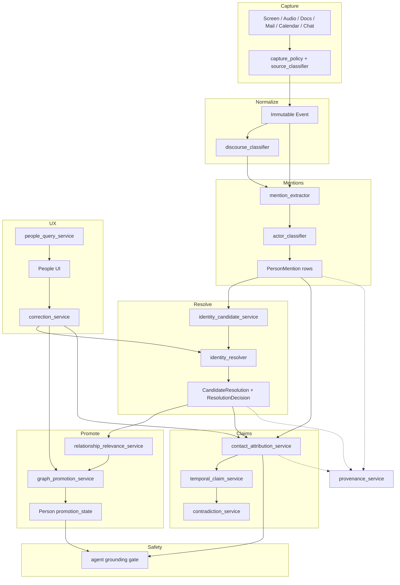

# People Intelligence Architecture — Mnemos.ai / nexus_v1

**Status:** Implementation-ready design · July 20, 2026  
**Audience:** Principal / senior engineers executing the People pipeline redesign  
**Scope:** Person ingestion → identity resolution → contact attribution → People graph → UI → agent safety  
**Constraint:** Local-first personal memory; provenance mandatory; irreversible mutations high-precision only

---

## A. Executive technical assessment

### What is strong today

| Strength | Evidence in codebase |
|---|---|
| Typed facts + graph edges with confidence/origin | `facts`, `relations`, `graph.rebuild` |
| Extraction schema for owners/parties | `extractor.py`, `documents._persist_facts` |
| Cascading resolver (exact → prefix → phonetic → embed) | `resolution.py`, `entity_correction.py` |
| Name-quality write gate | `name_quality.py` |
| Fact hygiene (span, conf floor, supersede) | `fact_gate.py` |
| Provenance stubs for audio | `provenance.py` |
| Recent intake filters (CLI, social feed, OS account) | `surface_filters.py`, `screen_extract.py` |
| Safer contact mining (possessive / local-part) | `person_details.py` |
| User overrides for contact fields | `person_attrs` |

### What remains unsafe

1. **Mention ≡ identity.** Extraction emits a name string and `resolve_person` immediately creates or merges a durable `people` row.
2. **No candidate set.** Ambiguity collapses to one ID at write time; alternatives are discarded.
3. **No promotion lifecycle.** Anyone created appears in People UI; no “observed vs active relationship” distinction.
4. **Contact fields are mined views + override columns**, not evidence-linked claims with temporal validity.
5. **Merges are destructive** (alias absorption into one row); no first-class reversible `MergeOperation`.
6. **Source/discourse policy is scattered** (CLI scrub, social skip, prompt text) — not a central matrix.
7. **Public docs still create people** via bylines/mentions when extract emits owners.
8. **Agent actions can ground on mined contacts** without verification gates.
9. **Reprocessing** re-runs extract/resolve without immutable mention ledger → duplicate risk.
10. **Confidence is one-dimensional** (ASR logprob / extract conf) — not calibrated for identity/contact/currentness.

### Target system (one sentence)

Preserve every person *mention* as immutable evidence; resolve to *candidate sets* with positive and negative scores; promote to the People graph only with relationship-relevance evidence; attach contacts only as versioned claims; make every merge/split/correction reversible and explainable.

---

## B. Proposed architecture



### Interaction rules

- **Events are append-only.** Reprocessing creates new derived versions keyed by `(event_id, pipeline_version)`.
- **Mentions never delete.** Rejection sets `resolution_status=rejected`; raw mention remains.
- **People rows are indirection targets**, not bags that absorb history. Soft-merge uses `MERGED_INTO` + alias edges.
- **LLM assists classification and feature suggestion only.** Schema validation + deterministic scorers own mutations.
- **Async by default** after Event insert: mention → resolve → promote → contact (worker jobs). Sync path only for user corrections and agent preflight.

---

## C. Domain model

### C.1 Storage strategy (SQLite-first)

Keep `events` immutable. Add derived tables. Do **not** drop `people` — extend with `promotion_state`, `actor_type`, `canonical_of`. Contact columns leave `person_attrs` as *user override* only; system beliefs move to `person_contact_points`.

### C.2 Core schemas (SQL DDL sketch)

```sql
-- Immutable observation (existing events table; add columns)
-- ALTER events ADD COLUMN source_class TEXT;
-- ALTER events ADD COLUMN discourse_class TEXT;
-- ALTER events ADD COLUMN policy_version TEXT;

CREATE TABLE IF NOT EXISTS person_mentions (
  mention_id        INTEGER PRIMARY KEY,
  event_id          INTEGER NOT NULL REFERENCES events(id),
  source_id         TEXT,                    -- app/window/doc hash
  raw_text          TEXT NOT NULL,
  normalized_text   TEXT NOT NULL,
  char_start        INTEGER,
  char_end          INTEGER,
  surrounding_quote TEXT,
  sentence_text     TEXT,
  grammatical_role  TEXT,                    -- subject|object|possessive|vocative|unknown
  discourse_role    TEXT NOT NULL,           -- from discourse_classifier
  speaker_id        TEXT,                    -- diarization / self / other
  observed_at       REAL NOT NULL,
  extractor_version TEXT NOT NULL,
  person_probability REAL,                   -- P(is_person_mention)
  extraction_confidence REAL,
  actor_type_json   TEXT,                    -- [{type, p}, ...]
  identity_hints_json TEXT,                  -- org, email_local, channel, ...
  resolution_status TEXT NOT NULL DEFAULT 'unresolved',
  -- unresolved|provisionally_resolved|resolved|rejected|superseded
  resolved_person_id INTEGER,                -- nullable; provisional OK
  resolution_confidence REAL,
  relationship_relevance REAL,               -- 0..1 personal relevance
  pipeline_version  TEXT NOT NULL,
  created_at        REAL NOT NULL,
  updated_at        REAL NOT NULL
);
CREATE INDEX IF NOT EXISTS idx_pm_event ON person_mentions(event_id);
CREATE INDEX IF NOT EXISTS idx_pm_norm ON person_mentions(normalized_text);
CREATE INDEX IF NOT EXISTS idx_pm_person ON person_mentions(resolved_person_id);
CREATE INDEX IF NOT EXISTS idx_pm_status ON person_mentions(resolution_status);

CREATE TABLE IF NOT EXISTS identity_candidates (
  candidate_id   INTEGER PRIMARY KEY,
  mention_id     INTEGER NOT NULL REFERENCES person_mentions(mention_id),
  person_id      INTEGER,                    -- NULL = "new person" hypothesis
  is_new         INTEGER NOT NULL DEFAULT 0,
  score          REAL NOT NULL,
  pos_evidence_json TEXT,
  neg_evidence_json TEXT,
  rank           INTEGER NOT NULL,
  created_at     REAL NOT NULL
);

CREATE TABLE IF NOT EXISTS resolution_decisions (
  decision_id    INTEGER PRIMARY KEY,
  mention_id     INTEGER NOT NULL,
  decision       TEXT NOT NULL,              -- auto_resolve|leave_open|create_new|reject
  chosen_person_id INTEGER,
  confidence     REAL NOT NULL,
  threshold_policy TEXT NOT NULL,
  resolver_version TEXT NOT NULL,
  feature_vector_json TEXT,
  decided_at     REAL NOT NULL,
  actor          TEXT NOT NULL DEFAULT 'system'  -- system|user
);

-- Extend people
-- ALTER people ADD COLUMN actor_type TEXT DEFAULT 'human_person';
-- ALTER people ADD COLUMN promotion_state TEXT DEFAULT 'candidate';
-- ALTER people ADD COLUMN canonical_person_id INTEGER;  -- if soft-merged away
-- ALTER people ADD COLUMN public_figure INTEGER DEFAULT 0;
-- ALTER people ADD COLUMN hide_from_people INTEGER DEFAULT 0;

CREATE TABLE IF NOT EXISTS person_contact_points (
  contact_point_id INTEGER PRIMARY KEY,
  person_id        INTEGER NOT NULL,
  type             TEXT NOT NULL,            -- email|phone|handle|website|address|messaging
  value_normalized TEXT NOT NULL,
  value_display    TEXT NOT NULL,
  confidence       REAL NOT NULL,
  attribution_method TEXT NOT NULL,
  verification_status TEXT NOT NULL DEFAULT 'unverified',
  -- unverified|attributed|user_verified|outdated|rejected
  source_event_id  INTEGER,
  source_document_id TEXT,
  evidence_quote   TEXT,
  discourse_role   TEXT,
  first_seen_at    REAL NOT NULL,
  last_seen_at     REAL NOT NULL,
  valid_from       REAL,
  valid_to         REAL,
  status           TEXT NOT NULL DEFAULT 'active', -- active|historical|superseded|rejected
  created_by       TEXT NOT NULL,            -- system|user
  supersedes_id    INTEGER,
  pipeline_version TEXT NOT NULL,
  UNIQUE(person_id, type, value_normalized, status)  -- soft: enforce in app for active only
);

CREATE TABLE IF NOT EXISTS relationship_claims (
  claim_id       INTEGER PRIMARY KEY,
  from_person_id INTEGER,
  to_person_id   INTEGER,
  predicate      TEXT NOT NULL,              -- COMMUNICATED_WITH|MANAGES|...
  confidence     REAL NOT NULL,
  valid_from     REAL,
  valid_to       REAL,
  source_event_id INTEGER,
  evidence_quote TEXT,
  status         TEXT NOT NULL DEFAULT 'active',
  created_at     REAL NOT NULL
);

CREATE TABLE IF NOT EXISTS employment_claims (
  claim_id       INTEGER PRIMARY KEY,
  person_id      INTEGER NOT NULL,
  org_entity_id  INTEGER,
  org_name       TEXT,
  role_title     TEXT,
  confidence     REAL NOT NULL,
  valid_from     REAL,
  valid_to       REAL,
  status         TEXT NOT NULL,              -- current|historical|uncertain
  source_event_id INTEGER,
  evidence_quote TEXT,
  created_at     REAL NOT NULL
);

CREATE TABLE IF NOT EXISTS relational_references (
  reference_id   INTEGER PRIMARY KEY,
  raw_phrase     TEXT NOT NULL,
  relation_type  TEXT,                       -- manager|sibling|lawyer|...
  anchor_person_id INTEGER,                  -- "my" → self; "Patrick's" → Patrick
  context_event_id INTEGER NOT NULL,
  candidate_person_ids_json TEXT,
  valid_from     REAL,
  valid_to       REAL,
  confidence     REAL,
  resolution_status TEXT NOT NULL DEFAULT 'unresolved',
  resolved_person_id INTEGER,
  created_at     REAL NOT NULL
);

CREATE TABLE IF NOT EXISTS merge_operations (
  merge_id       INTEGER PRIMARY KEY,
  survivor_person_id INTEGER NOT NULL,
  absorbed_person_id INTEGER NOT NULL,
  mode           TEXT NOT NULL,              -- soft_merge|alias_link|hard_redirect
  reason         TEXT,
  confidence     REAL,
  resolver_version TEXT,
  actor          TEXT NOT NULL,              -- system|user
  decided_at     REAL NOT NULL,
  reversed_at    REAL,
  reverse_of     INTEGER,
  evidence_json  TEXT
);

CREATE TABLE IF NOT EXISTS contradiction_groups (
  group_id       INTEGER PRIMARY KEY,
  person_id      INTEGER NOT NULL,
  field_type     TEXT NOT NULL,              -- phone|email|role|employer|...
  status         TEXT NOT NULL,              -- open|resolved_user|resolved_policy
  preferred_claim_id INTEGER,
  created_at     REAL NOT NULL,
  updated_at     REAL NOT NULL
);

CREATE TABLE IF NOT EXISTS contradiction_members (
  group_id       INTEGER NOT NULL,
  contact_point_id INTEGER,                  -- or employment_claim_id via polymorphic
  claim_table    TEXT NOT NULL,
  claim_row_id   INTEGER NOT NULL,
  PRIMARY KEY (group_id, claim_table, claim_row_id)
);

CREATE TABLE IF NOT EXISTS corrections (
  correction_id  INTEGER PRIMARY KEY,
  kind           TEXT NOT NULL,              -- confirm_identity|not_same|merge|split|...
  payload_json   TEXT NOT NULL,
  creates_constraint INTEGER NOT NULL DEFAULT 1,
  constraint_weight REAL DEFAULT 1.0,
  actor          TEXT NOT NULL DEFAULT 'user',
  created_at     REAL NOT NULL,
  pipeline_version TEXT
);

CREATE TABLE IF NOT EXISTS provenance_records (
  prov_id        INTEGER PRIMARY KEY,
  subject_type   TEXT NOT NULL,              -- mention|person|contact|merge|promotion
  subject_id     INTEGER NOT NULL,
  event_id       INTEGER,
  quote          TEXT,
  discourse_role TEXT,
  extractor_version TEXT,
  resolver_version TEXT,
  confidence     REAL,
  user_confirmed INTEGER DEFAULT 0,
  created_at     REAL NOT NULL
);
```

### C.3 Python dataclasses (selected)

```python
@dataclass(frozen=True)
class PersonMention:
    mention_id: int | None
    event_id: int
    raw_text: str
    normalized_text: str
    discourse_role: str
    observed_at: float
    extractor_version: str
    pipeline_version: str
    # required above; derived below
    char_start: int | None = None
    char_end: int | None = None
    surrounding_quote: str | None = None
    sentence_text: str | None = None
    grammatical_role: str = "unknown"
    speaker_id: str | None = None
    person_probability: float | None = None
    extraction_confidence: float | None = None
    actor_type_candidates: tuple[tuple[str, float], ...] = ()
    identity_hints: dict | None = None
    resolution_status: str = "unresolved"
    resolved_person_id: int | None = None
    resolution_confidence: float | None = None
    relationship_relevance: float | None = None

# Mentions are append-only: corrections supersede via new ResolutionDecision,
# not in-place mutation of raw_text. updated_at only for resolution fields.
```

**Immutability:** `raw_text`, offsets, `event_id`, `extractor_version` never change. Resolution fields may update; each change inserts `resolution_decisions` + `provenance_records`.

**Multi-candidate:** `identity_candidates` stores full set; `resolved_person_id` set only when decision ≠ `leave_open`.

**UI:** Mentions hidden by default; shown in Evidence drawer and Unresolved queue.

---

## D. Service interfaces

```python
class SourceClassifier:
    def classify(self, event: Event) -> SourceClass: ...

class DiscourseClassifier:
    def classify(self, event: Event, spans: list[TextSpan]) -> list[DiscourseLabel]: ...

class MentionExtractor:
    def extract(self, event: Event, discourse: list[DiscourseLabel]) -> list[PersonMention]: ...

class ActorClassifier:
    def classify(self, mention: PersonMention, event: Event) -> list[tuple[ActorType, float]]: ...

class IdentityCandidateService:
    def generate(self, mention: PersonMention, ctx: ResolveContext) -> list[IdentityCandidate]: ...

class IdentityResolver:
    def resolve(self, mention: PersonMention, candidates: list[IdentityCandidate]) -> ResolutionDecision: ...

class RelationshipRelevanceService:
    def score(self, person_id: int | None, mention: PersonMention, history: PersonHistory) -> float: ...

class GraphPromotionService:
    def evaluate(self, person_id: int) -> PromotionTransition | None: ...

class ContactAttributionService:
    def attribute(self, event: Event, mentions: list[PersonMention]) -> list[ContactPointClaim]: ...

class TemporalClaimService:
    def upsert_current(self, claim: ContactPointClaim) -> ContradictionGroup | None: ...

class ContradictionService:
    def open_or_extend(self, person_id: int, field_type: str, claims: list[int]) -> int: ...
    def preferred(self, group_id: int) -> int | None: ...

class MergeService:
    def soft_merge(self, survivor: int, absorbed: int, *, reason, confidence, actor) -> int: ...
    def split(self, merge_id: int, *, actor) -> None: ...

class CorrectionService:
    def apply(self, correction: Correction) -> None: ...  # durable constraint + rerank hooks

class PeopleQueryService:
    def list_people(self, filter: PeopleFilter) -> list[PersonCardDTO]: ...
    def explain(self, person_id: int) -> PersonExplanationDTO: ...

class ProvenanceService:
    def for_subject(self, subject_type: str, subject_id: int) -> list[ProvenanceRecord]: ...

class AgentPeopleGate:
    def resolve_action_target(self, intent: ActionIntent) -> ActionTargetDecision: ...
    # allow | clarify | block
```

### Worker jobs (async)

| Job | Trigger | Idempotency key |
|---|---|---|
| `people.mentions` | new event | `event_id:mention_v` |
| `people.resolve` | new mentions | `mention_id:resolver_v` |
| `people.promote` | resolution/correction | `person_id:promo_v` |
| `people.contacts` | event+mentions | `event_id:contact_v` |
| `people.backfill` | migration | `shard:range:version` |

---

## E. Resolution algorithm (pseudocode)

```text
function process_event(event):
  source = SourceClassifier.classify(event)
  policy = SourcePolicy.for(source)
  if not policy.extract_mentions: return

  discourse = DiscourseClassifier.classify(event)
  mentions = MentionExtractor.extract(event, discourse)
  for m in mentions:
    if policy.blocks_actor_creation and m.looks_like_public_only:
      m.resolution_status = reject_as_knowledge_only
      persist(m); continue

    m.actor_type_candidates = ActorClassifier.classify(m, event)
    persist(m)  # PersonMention first-class

    if not policy.create_person_candidates: continue

    cands = IdentityCandidateService.generate(m, ctx)
    # always include NewPerson hypothesis
    decision = IdentityResolver.resolve(m, cands)
    persist(decision, cands)

    if decision.decision == auto_resolve:
      link(m, decision.chosen_person_id)
    elif decision.decision == create_new:
      if policy.create_person_candidates and m.relationship_relevance >= τ_create:
        pid = create_person(m, promotion_state=candidate)
        link(m, pid)
      else:
        leave_open(m)  # quarantine
    else:
      leave_open(m)

    if m.resolved_person_id:
      GraphPromotionService.evaluate(m.resolved_person_id)

  if policy.extract_contact_details:
    ContactAttributionService.attribute(event, mentions)
```

### Candidate generation

```text
generate(m):
  blocking_keys = {
    exact_alias(m.normalized),
    phonetic_bucket(m.normalized),
    email_local_hint(m),
    org_cooccurrence(m),
    recent_interaction_window(30d),
    same_meeting_participants(event),
  }
  pool = union(lookup(k) for k in blocking_keys)  # cap 50
  for p in pool:
    pos = score_positive(m, p)   # name, phonetic, org, channel, habits
    neg = score_negative(m, p)   # both in same event as distinct, different employer, user constraint
    score = sigmoid(w·pos - v·neg + bias)
  add NewPerson with prior from rarity(m.normalized)
  return topK sorted by score
```

### Scoring model (local-first choice)

**Hybrid deterministic + logistic scorer** (not LLM-as-resolver):

- Features: exact match, token Jaccard, Double Metaphone, edit distance, org overlap, email local match, co-mention graph PMI, channel match, recency, user correction constraints (±∞ hard).
- Train later on correction labels; ship v1 with hand-calibrated weights.
- At scale: pairwise LightGBM; same feature schema.

### Thresholds (starting points — calibrate on bench)

| Decision | Condition |
|---|---|
| Auto-resolve | `top1 ≥ 0.92` AND `top1 - top2 ≥ 0.15` AND `neg < 0.2` |
| Create new | `NewPerson ≥ 0.85` AND no cand ≥ 0.60 AND relevance ≥ 0.55 AND policy allows |
| Leave open | otherwise |
| Hard block merge | any user `not_same` constraint OR both appear as distinct participants in one event |

### Lowercase ASR (section 8)

```text
detect_person_mention(token_span):
  # NEVER: title_case ⇒ is_person
  features = {POS, dependency, possessive_neighbor, known_alias,
              verb_frame (spoke_with/email/call), speaker_history}
  p = P(person | features)
  if p < 0.55: skip  # "chase the invoice", "summer starts"
  normalized = casefold_for_match(span)  # identity key
  display = title_case_if_alphabetic_1_or_2_tokens(span)  # display only
```

Normalization for matching ≠ canonical legal name. Canonical name updates only via evidence or user rename.

---

## F. Contact-attribution algorithm

```text
function attribute(event, mentions):
  contacts = detect_contact_values(event.text)  # email/phone/handle regex + NER
  for c in contacts:
    scores = []
    for m in mentions:
      s = 0
      s += 3.0 if possessive_link(m, c)          # "Marc's email is X"
      s += 2.5 if reach_at_pattern(m, c)         # "Reach Marc at X"
      s += 2.0 if same_clause_dep(m, c)
      s += 1.5 if email_local_matches(m, c)
      s += 1.0 if signature_block_owner(m, c)
      s += 0.5 if repeated_cooccurrence(m, c)
      s -= 2.0 if competing_mention_closer(m, c)
      s -= 3.0 if discourse in {quoted, public, forwarded} and not policy.allow
      s -= 4.0 if "will email X at Y" and m is subject not X  # Justin≠marc@
      scores.append((m, s))
    best, smax = argmax(scores)
    if smax < τ_attr (2.0): emit unassigned_contact_evidence; continue
    if second_best within 0.5: leave ambiguous contradiction; continue
    write ContactPointClaim(person=best.resolved or provisional, ...)
```

### Worked examples

| Text | Expected |
|---|---|
| “Marc’s email is marc@acme.com.” | Marc ← email (possessive) |
| “Reach Marc at marc@acme.com.” | Marc ← email (reach-at) |
| “Justin will email Marc at marc@acme.com.” | Marc ← email; Justin gets no email |
| “Email Justin and copy marc@acme.com.” | Justin ← no email from marc@; marc@ unassigned or Marc if Marc mentioned elsewhere |
| “Marc forwarded Justin’s number.” | Justin ← phone; Marc is intermediary |
| “Patrick’s assistant can be reached at assistant@firm.com.” | RelationalReference(assistant of Patrick); contact on assistant role/person if resolved — **not** Patrick’s personal email |
| Webpage with 5 execs + 5 emails | **No auto person contacts** (public leadership page policy); org entities + claims only |
| Forwarded thread, 3 signatures | Contacts attributed only inside signature ownership spans; else unassigned |

---

## G. Source-policy matrix

Legend: **Y** allow · **C** conditional (discourse/compose) · **N** deny · **K** knowledge entities only (no People promotion)

| Source class | Mentions | Knowledge entity | Person candidate | Relationship evidence | Contact extract | Commitments | Claims | Update people | ID evidence | Current role/contact |
|---|---|---|---|---|---|---|---|---|---|---|
| private_conversation | Y | Y | Y | Y | Y | Y | Y | Y | Y | Y |
| meeting_transcript | Y | Y | Y | Y | C | Y | Y | Y | Y | C |
| direct_message | Y | Y | Y | Y | Y | Y | Y | Y | Y | Y |
| email | Y | Y | Y | Y | Y | Y | Y | Y | Y | Y |
| calendar | Y | Y | Y | Y | N | C | C | C | Y | N |
| contact_record | Y | Y | Y | Y | Y | N | Y | Y | Y | Y |
| user_authored_document | Y | Y | Y | C | C | Y | Y | C | C | C |
| shared_document | Y | Y | C | C | C | C | Y | N | C | N |
| presentation | Y | Y | C | N | N | C | Y | N | N | N |
| browser_article | Y | Y | N→K | N | N | N | Y | N | N | N |
| news_page | Y | Y | N→K | N | N | N | Y | N | N | N |
| social_feed | C | C | N | N | N | N | N | N | N | N |
| social_composer | Y | Y | Y | C | C | Y | C | C | C | C |
| advertisement | N | N | N | N | N | N | N | N | N | N |
| terminal | N | N | N | N | N | N | N | N | N | N |
| code_editor | C | C | N | N | N | N | C | N | N | N |
| system_ui | N | N | N | N | N | N | N | N | N | N |
| filesystem | N | N | N | N | N | N | N | N | N | N |
| notification | C | C | C | C | C | C | C | N | C | N |
| unknown | C | C | N | N | N | N | C | N | N | N |

**Config:** `data/source_policies.json` + `QUILL_SOURCE_POLICY_VERSION`. Unit-test every cell.

**News/PDF/decks:** Mentions extracted for *claims/topics/orgs* (K path). Person candidates only if discourse shows user-authored annotation or direct address to user — preserves research utility without People pollution.

---

## H. People lifecycle (promotion states)

| State | Meaning | Visible in People UI |
|---|---|---|
| `observed` | Mentions exist; no person row or only provisional | No (Unresolved queue) |
| `candidate` | Person row exists; low relevance | Optional “Possible people” |
| `recognized` | Repeated independent evidence | Yes, muted |
| `active` | Meaningful relationship / commitments / DM / meetings | Yes, default |
| `trusted` | User-confirmed or high-evidence verified contacts | Yes, prioritized |
| `inactive` | No recent interaction; was active | Archived section |
| `archived` | User archived | Hidden unless filter |
| `rejected` | User/system rejected as not-a-person-for-People | Hidden |

### Promotion signals (weighted; need score ≥ τ)

Direct address · meeting participant · email from/to · calendar attendee · commitment owner/recipient · ≥3 independent events · known org+project · DM thread · verified contact · user confirm · open task · recency · recurrence.

### Demotion

No interaction > N days → `inactive`. User archive → `archived`. Evidence only from public/K path → never above `candidate`.

---

## I. Merge and split semantics

**Prefer soft merge (indirection):**

```text
soft_merge(survivor S, absorbed A):
  assert not hard_blocked(S, A)
  write merge_operations(...)
  set A.canonical_person_id = S
  set A.promotion_state = archived
  add edge A -MERGED_INTO-> S
  redirect queries: resolve_canonical(id) = walk canonical_person_id
  DO NOT delete A's mentions, contacts, edges
  aliases of A become aliases of S with provenance merge_id
```

**Split:**

```text
split(merge_id):
  mark merge reversed_at
  clear absorbed.canonical_person_id
  restore promotion_state from snapshot in merge_operations.evidence_json
  reassign mentions whose only evidence was the merge back to candidates leave_open
  contact points stay on original person_id (never silently moved without provenance)
```

**Alias-link** (weaker): add alias without canonical redirect — for nicknames.

Physical row absorption is **forbidden** in v1–v2.

---

## J. Migration plan

1. **Backup** `data/quill.db` (+ Lance).
2. **Schema add** new tables/columns; dual-write off.
3. **Backfill PersonMention** from facts with people refs + event text spans (best-effort offsets).
4. **Classify existing people:** machine account names → `actor_type=machine_user`, `hide_from_people=1`; celebrity-like single-mention public → `public_figure=1`, `promotion_state=candidate`.
5. **Contact migration:** `person_attrs` → `person_contact_points` with `verification_status=unverified`, `created_by=migration`, confidence 0.4.
6. **Mined-only emails/phones** without possessive provenance → `status=uncertain`, open contradiction if multiple.
7. **Suspicious merges:** aliases that are longer-name prefixes of different first tokens → review queue.
8. **Preserve legacy IDs** as `people.id`; add `canonical_person_id`.
9. **Recalc promotion** from commitments/tasks/relations.
10. **Mark** `pipeline_version=legacy_migrated`.
11. **Review queues** in UI: Fake people · Bad contacts · Ambiguous merges.
12. **Validation:** counts, orphan edges, sample audit 100 people.
13. **Rollback:** restore backup; feature flag `QUILL_PEOPLE_V2=0`.

---

## K. Testing plan

| Layer | Focus |
|---|---|
| Unit | Policy matrix cells; mention detector ASR traps; attribution examples; prefix match; OS account |
| Integration | Event → mention → candidates → decision; contact claims; soft merge/split |
| E2E | Meeting transcript + screen email → People card with provenance |
| Adversarial | Categories in §23 of the brief (terminal, ambiguous names, false merges, public, quoted, relational, temporal) |
| Regression | Golden JSONL fixtures; fail CI on false-merge |
| Calibration | Reliability diagrams for identity/contact scores |
| Migration | Snapshot DB → migrate → invariants |

---

## L. Metrics and targets

| Metric | Offline target | Prod alert |
|---|---|---|
| Person-creation precision (active+) | ≥ 0.95 | spike < 0.90 |
| False-merge rate | ≤ 0.5% | any merge reversed by user > 5%/wk |
| Contact-attribution precision | ≥ 0.97 | < 0.95 |
| Public-content People contamination | ≤ 1% of new active people | spike |
| Machine-identity contamination | 0 in active People | any |
| Self misrouting | 0 | any |
| Unresolved ambiguity rate | 10–40% of mentions OK | > 70% stuck |
| Correction rate | declining | rising after release |
| Calibration ECE (identity) | ≤ 0.08 | > 0.15 |

---

## M. Rollout plan

| Phase | Scope | Success | Rollback |
|---|---|---|---|
| 0 | Bench + instrumentation | Golden suite green | n/a |
| 1 | PersonMention shadow (no UI change) | Mentions ≈ extract owners recall±10% | disable job |
| 2 | Source + discourse policy | Contamination metrics drop | policy_version pin |
| 3 | Candidate resolver shadow vs legacy | Agreement on easy; legacy merges flagged | keep legacy write |
| 4 | ContactPointClaim dual-read | Attribution precision on bench | read legacy attrs |
| 5 | Promotion-state People UI | User confusion ↓; fake people ↓ | flag UI |
| 6 | Soft merge/split | Reversible merges work | disable auto-merge |
| 7 | Agent gate | Zero misdirected sends in staging | gate fail-closed |
| 8 | Legacy cleanup queues | Review queue drained | stop auto demotions |

Shadow mode: write v2 tables; People UI still reads v1 until phase 5.

---

## N. Prioritized engineering backlog

### P0 — Trust / integrity blockers

| Item | Why | Discipline | Deps | Complexity | Migration risk | Acceptance |
|---|---|---|---|---|---|---|
| PersonMention table + extract shadow | Stop mention=identity | Backend | — | M | Low | Mentions persisted per event |
| Source policy matrix wired | Centralize contamination | Backend | — | M | Low | Matrix tests 100% |
| Disable auto people from social/news/terminal | Already partial; finish | Backend | policy | S | Low | Bench contamination ≤1% |
| Contact attribution claims (dual-write) | Stop wrong emails | Backend | mentions | M | M | Bench attr ≥0.97 |
| Agent contact gate fail-closed | Safety | Backend | contacts | S | Low | Ambiguous → clarify |

### P1 — Core architecture

| Item | Why | Discipline | Deps | Complexity | Risk | Acceptance |
|---|---|---|---|---|---|---|
| Candidate resolver + thresholds | Ambiguity preserved | ML+Backend | mentions | L | M | leave_open works |
| Negative evidence + constraints | False-merge ↓ | ML | resolver | M | L | Chris/Christina separate |
| Promotion states | People ≠ every name | Backend+UI | resolver | M | M | Active list precision ↑ |
| Soft merge operations | Reversibility | Backend | people | M | H | Split restores |
| Discourse classifier v1 | Quote/public vs authored | ML | — | M | L | Fixture suite |

### P2 — UI / explainability

| Item | Why | Discipline | Deps | Complexity | Risk | Acceptance |
|---|---|---|---|---|---|---|
| Evidence drawer | Trust | Frontend | provenance | M | L | Quote+source shown |
| Unresolved / review queues | Corrections | Frontend | mentions | M | L | User can confirm/split |
| Confidence pills | UX honesty | Frontend | scores | S | L | No false certainty |
| Correction → constraint learning | Improve over time | Backend | corrections | M | M | not_same blocks merge |

### P3 — Models / optimization

| Item | Why | Discipline | Deps | Complexity | Risk | Acceptance |
|---|---|---|---|---|---|---|
| Calibrated logistic/LightGBM | Better scores | ML | labels | L | M | ECE ≤0.08 |
| RelationalReference | my manager | Backend | — | M | L | Unresolved OK |
| Temporal employment claims | Job changes | Backend | — | M | M | History preserved |
| Blocking index at scale | Perf | Backend | — | M | L | p95 resolve <50ms local |

---

## O. Failure-mode analysis (≥25)

| # | Failure | Mitigation |
|---|---|---|
| 1 | Terminal → person | Source=terminal deny |
| 2 | OS user → person | actor_type machine_user; reject People |
| 3 | OS user → self | No self mapping |
| 4 | Celebrity feed → active person | social_feed policy N |
| 5 | News byline → relationship | K path only |
| 6 | Justin steals marc@ | Attribution subject/object rules |
| 7 | Chris→Christina merge | Token prefix only; neg evidence |
| 8 | Two John Smiths merge | Org/email domain neg; leave_open |
| 9 | Lowercase “will said” → person | Contextual P(person) |
| 10 | “Chase the invoice” → person | Verb-object frames |
| 11 | Title-case proves personhood | Forbidden |
| 12 | LLM invents email | Schema+regex validate only observed spans |
| 13 | Forwarded signature → user contact | discourse=forwarded |
| 14 | Assistant@ → Patrick | RelationalReference |
| 15 | Webpage exec list → 5 people | public policy |
| 16 | Duplicate people on reprocess | idempotency keys |
| 17 | Hard delete on merge | Soft merge only |
| 18 | Split loses contacts | Contacts stay on original ids |
| 19 | Stale phone preferred | temporal + contradiction UI |
| 20 | Agent emails wrong Marc | Agent gate + approval show target |
| 21 | Embeddings false-merge short names | High τ + margin |
| 22 | Quarantine never reviewed | Unresolved queue + metrics |
| 23 | Policy too strict → missed coworkers | Mentions retained; promotion recall metric |
| 24 | Correction overfitting | Bounded constraint weight; decay |
| 25 | Debug logs leak PII | Redacted decision logs |
| 26 | Cloud VLM exfil screen | Local-first; escalate policy |
| 27 | Forget incomplete | Cascading delete by provenance |
| 28 | Calendar invite spam people | calendar contact extract N; attendees candidate only |
| 29 | Code string “Alice” | code_editor policy |
| 30 | Example slide “email Marc” | discourse=example_content |

---

## 1–12 Detailed design notes (compressed but binding)

### PersonMention required vs derived

**Required:** event_id, raw_text, normalized_text, discourse_role, observed_at, extractor_version, pipeline_version, resolution_status.  
**Derived:** probabilities, actor types, resolution fields, relevance.  
**Reprocess:** new extractor_version writes new mentions with `supersedes` link; old kept for audit.

### Actor taxonomy

Typing **before** hard identity: P(type|mention,source,discourse). Ambiguity = distribution. `social_handle` may later `REFERS_TO` person. `machine_user` queryable in debug, hidden from People. `public_figure` is knowledge entity bridge, `hide_from_people` unless user pins.

### RelationalReference

Unresolved until name evidence; `my manager` scoped by `valid_from/to`; new manager = new claim, old historical. Never assume global stability.

### Confidence dimensions (do not multiply blindly)

Separate scores for mention / actor_type / identity / relationship_relevance / contact_attribution / verification / currentness / claim / source_reliability. Auto-mutations use **identity** and **contact_attribution** only with margins. UI may show qualitative bands. Agents use **verification** or user-confirmed only for send/call.

### Graph semantics (selected)

User-visible retrieval: Person(active+), Commitment, Claim, ContactPoint(verified|attributed), WORKS_AT current, COMMUNICATED_WITH.  
Internal: PersonMention, POSSIBLY_REFERS_TO, MERGED_INTO, CONTRADICTS.  
Actions: only Person+ContactPoint with verification_status ∈ {user_verified, attributed} AND identity_confidence ≥ τ AND promotion ≥ active — else clarify.

### Privacy

Encryption at rest for DB (SQLCipher optional); secrets in OS keychain; evidence redaction in logs; forget = tombstone + blob delete; retention tiers; no training on user data without consent; local models default for classify.

### Performance

Blocking keys + top-50 candidates; indexes on normalized_text, person_id, event_id; incremental promote; archive inactive mentions blobs; years of data OK on SQLite with WAL + periodic VACUUM; vectors in Lance for people names only.

---

## Endorsed target architecture

**Immutable events → PersonMentions → actor-typed candidates → scored resolution with leave-open → relevance-gated promotion → evidence-linked contact claims with contradictions → soft reversible merges → explanation-first People UI → fail-closed agent gate.**

Hybrid rules + calibrated lightweight scorer; LLM never sole resolver.

---

## Ten highest-priority implementation tasks

1. `person_mentions` schema + shadow extract job  
2. `data/source_policies.json` + classifier wiring  
3. Discourse labels v1 (authored / quoted / public / code / system)  
4. Candidate set resolver behind flag (shadow vs `resolve_person`)  
5. `person_contact_points` dual-write from attribution algo  
6. Promotion states + People list filter  
7. Soft `merge_operations` + split API  
8. Provenance explain API for person/contact  
9. AgentPeopleGate on email/call/send  
10. Golden adversarial bench in CI  

---

## Minimum viable version (MVP)

**MVP = Phases 0–4 shadow + Phase 5 read-path for promotion + contact claims**, still using legacy people IDs:

- Mentions stored  
- Source policy enforced (no terminal/social people)  
- Contacts as claims with attribution rules (no Justin←marc@)  
- People UI shows “Active” vs “Possible” and evidence quotes  
- No auto hard-merge; leave_open for ambiguity  
- Agent gate on contacts  

Defer: learned scorer, full relational references, employment temporal UI polish.

---

## Highest-risk technical unknowns

1. **Calibration of auto-resolve thresholds** on real personal data (cold start).  
2. **Discourse classification quality** on messy OCR screens.  
3. **Migration of already-wrong merges** without user review capacity.  
4. **Recall hit** if policy too aggressive on shared docs.  
5. **ASR person detection** false negatives for rare names.

---

## Acceptance criteria — trustworthy enough for approval-gated actions

The People pipeline may ground **approval-gated** actions when **all** hold:

1. Target person `promotion_state ∈ {active, trusted}`.  
2. Identity either user-confirmed OR (`identity_confidence ≥ 0.92` ∧ margin ≥ 0.15 ∧ no open ambiguity).  
3. Contact point `verification_status ∈ {user_verified, attributed}` with attribution score ≥ τ AND no open contradiction group for that field.  
4. Approval UI shows: person display name, contact value, evidence quote, source event/doc, confidence band, alternatives if any.  
5. Offline bench: false-merge ≤ 0.5%, contact precision ≥ 0.97, public contamination ≤ 1%, self/machine misrouting = 0 on golden set.  
6. Soft-merge/split round-trip tested; decision logs redacted but complete for replay.  
7. Feature flag kill-switch returns agents to clarify-only mode.

Until then: agents may **propose** (“Email Marc?”) with mandatory clarification when uncertain — never silent send.
